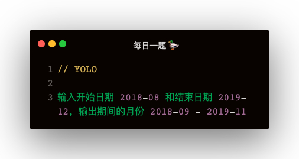

### 解答
```
function outputDate (startDate, endDate) {
    const ret = []
    const _start = new Date(startDate);
    const _end = new Date(endDate);

    function step () {
        const _month = _start.getMonth() + 1;
        const _year = _start.getFullYear();

        if (_month <= 12) {
            _start.setMonth(_month);
        } else {
            _start.setMonth(0);
            _start.setFullYear(_year + 1);
        }

        return {
            year: _year,
            month: String(_month).padStart(2, '0'),
        };
    }
    step();

    while (_start < _end) {
        const { year, month } = step();
        ret.push(`${year}-${month}`);
    }
    return ret;
}

const result = outputDate('2018-08', '2019-12');
console.log(result)
```