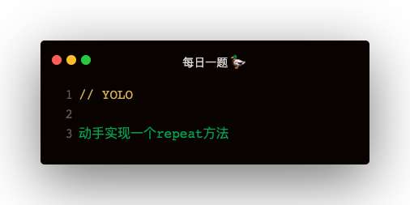

### 解答
```
function repeat (func, times, wait) {
    return function (...args) {
        function timeout () {
            if (times > 0) {
                times--;
                func.call(this, args);
                setTimeout(timeout, wait);
            }
        }
        timeout()
    }
}

const repeatFunc = repeat(() => console.log(111), 4, 3000);
repeatFunc();
```