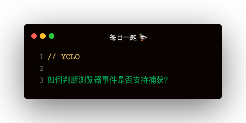

### 解答
```
let supportPassive = false;
const opts = {
    get passive () {
        console.log('browser event support passive');
        suportPassive = true;
    }
}
window.addEventListener('test-passive', null, opts);
```