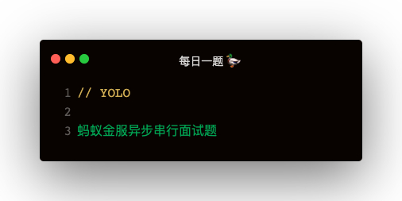

要求实现 createFlow，按照 a,b,延迟1秒,c,延迟1秒,d,e, done 的顺序打印

### 解答

```
const log = console.log;
const isFunc = obj => typeof obj === 'function';
function createFlow (flows) {
    return new Flow(flows);
}
class Flow {
    constructor (flows) {
        this.flows = flows;
    }
    async run (callback) {
        for (let flow of this.flows) {
            if (flow instanceof Flow) {
                const _flows = flow.flows;
                for (let _flow of _flows) {
                    isFunc(_flow) && await _flow();
                }
            }
            if (isFunc(flow)) {
                await flow();
            }
            if (Array.isArray(flow)) {
                for (let _flow of flow) {
                    isFunc(_flow) && await _flow();
                }
            }
        }
        isFunc(callback) && callback()
    }
}
```