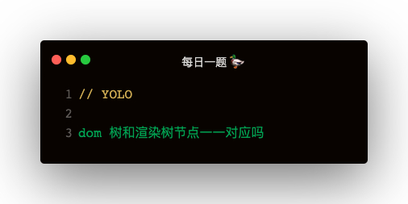
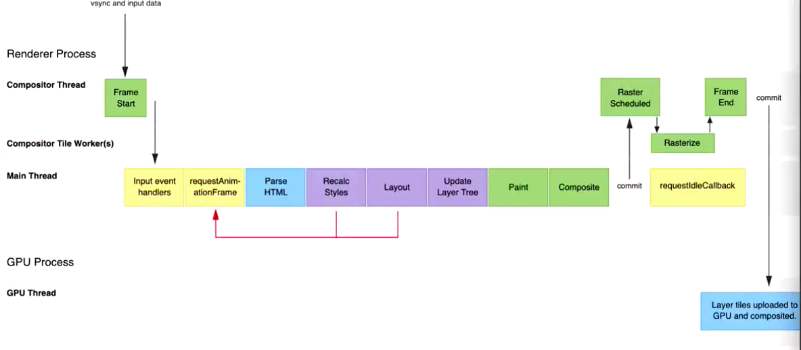

### 解答

浏览器一帧绘制的主要步骤：
1. 输入事件回调处理：比如滚动
2. requestAnimationFrame：上一帧定义的requestAnimationFrame
3. Parse HTML 生成 dom tree
4. Recalc Styles 生成 css tree
5. Layout：dom tree 和 css tree 结合生成 layout tree
6. Update Layer Tree
7. Paint：绘制
8. Composite: 合并图层
9. 微任务调用
10. 宏任务调用   

dom树和渲染树的节点并非一一对应的
1. css 为display的节点，dom树有，渲染树没有
2. css 伪元素，dom树没有，渲染树有   

### requestIdleCallback 是干什么用的
电脑屏幕一帧的时间根据屏幕刷新率确定 ✅ ：   
比如一台电脑为60HZ，意思就是1秒钟刷新60次，那么一帧的时间就是：1000/60 = 16.7ms   
一帧的绘制执行到 Composite ，有可能还没到16.7ms，有空闲时间，那么有多少空闲时间呢？   
使用 requestIdleCallback 查询空闲时间   

```
window.requestIdleCallback(idleDeadline => {
    console.log('是否过期：', idleDeadline.didTimeout);
    console.log('剩余时间：', idleDeadline.timeRemaining())
})
```


#### 图解

