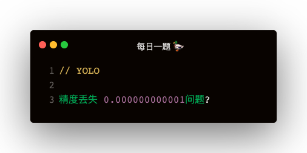

### 解答
js 的精度丢失问题，想必都遇到过，比如👇
```
0.3 * 0.75 = 0.22499999999999998
```   

其实值为 0.225，可是实际出来却是 0.22499999999999998，这是由 js 底层转换为二进制计算导致

#### 解决方案 toPrecision
```
(0.3 * 0.75).toPrecision(12) = '0.225000000000'

Number((0.3 * 0.75).toPrecision(12)).toPrecision(2) = 0.23
```   

为什么首次取精度为12，这是经验之谈，一般 12 位就够用了