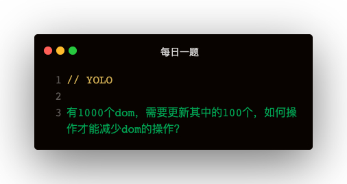

#### 解答
性能瓶颈：
1. DOM访问
2. DOM修改导致重绘和重排

##### 缓存DOM对象
将DOM对象缓存。避免重复查询

##### 文档片段
在文档片段上添加dom节点，不会影响到真是的dom结构   
**可以利用这一点将需要修改的dom一并修改完，保存至文档片段中，避免频繁修改dom而导致的重排跟重绘的过程**   

如果要对元素进行复杂的操作（删减，添加子节点），应将此元素先移除或cloneNode，操作完成之后再替换原来节点   

##### 使用innerHtml代替高频的appendChild

##### 最优的layout方案
批量读，一次性写。把任何导致重绘的操作放入requestAnimationFrame

##### 虚拟DOM
将dom抽象为虚拟dom，在dom变化时先对虚拟dom进行操作，通过dom diff将虚拟dom和原虚拟dom做对比，最终批量修改真实dom结构