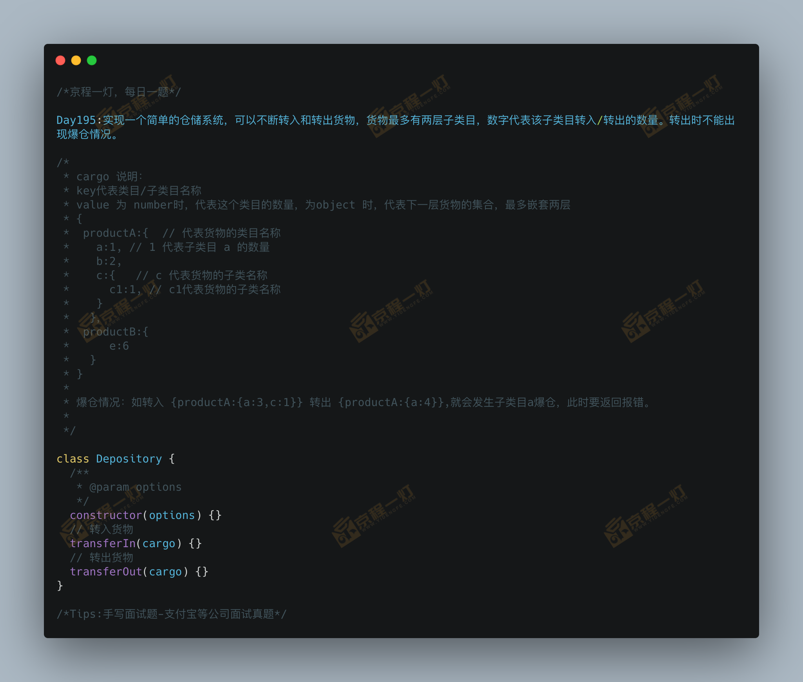

### 支付宝手写仓储系统
这道题看完了之后，主要是考虑到一个爆仓之后事件回滚
```
class Depository {
    constructor (options) {
        this.store = {}
    }
    transferIn (cargo) {
        this.transaction(transactions => {
            this.executeTask(this.store, cargo, (target, source, category, prodName) => {
                return () => {
                    category[prodName] = (target || 0) + source
                }
            }, transactions);
        })
    }
    transferOut (cargo) {
        this.transaction(transactions => {
            this.executeTask(this.store, cargo, (target, source, category, prodName) => {
                if (typeof target === 'number' && target >= source) {
                    return () => {
                        category[prodName] = target - source
                    }
                } else {
                    throw new Error(`${prodName} 爆仓了，需要 ${source}，仓储 ${target}`)
                }
            }, transactions);
        })
    }
    executeTask (target, source, callback, transactions) {
        for (let prop in source) {
            const propType = typeof source[prop]
            if (propType === 'object') {
                this.executeTask(target[prop] || (target[prop] = {}), source[prop], callback, transactions)
            }
            if (propType === 'number') {
                transactions.push(
                    callback(target[prop], source[prop], target, prop)
                )
            }
        }
    }
    transaction (task) {
        let transactions = [];
        try {
            task(transactions);
            for (let transaction of transactions) {
                transaction();
            }
            console.log('任务执行完毕，当前仓库储备：', JSON.stringify(this.store))
        } catch (e) {
            console.error(e.message);
            console.log('已爆仓，任务回滚，请提工单联系仓储，当前仓库储备：', JSON.stringify(this.store))
        }
    }
}
```