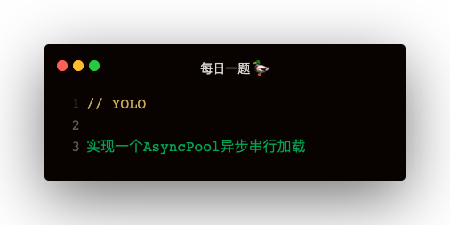

### AsyncPool 的使用
定义异步池大小，使异步任务排队执行
```
const asyncPool = require('tiny-async-pool')
const startTime = Date.now()

const tasks = [
    () => {
        return new Promise(resolve => {
            setTimeout(() => {
                resolve(1000)
            }, 1000)
        })
    },
    () => {
        return new Promise(resolve => {
            setTimeout(() => {
                resolve(1001)
            }, 1001)
        })
    },
    () => {
        return new Promise(resolve => {
            setTimeout(() => {
                resolve(1002)
            }, 1002)
        })
    },
    () => {
        return new Promise(resolve => {
            setTimeout(() => {
                resolve(1003)
            }, 1003)
        })
    },
    () => {
        return new Promise(resolve => {
            setTimeout(() => {
                resolve(1004)
            }, 1004)
        })
    },
    () => {
        return new Promise(resolve => {
            setTimeout(() => {
                resolve(1005)
            }, 1005)
        })
    },
]

asyncPool(2, tasks, async (task, next) => {
    const ret = await task();
    console.log(ret)
    return ret
}).then((...args) => {
    console.log(args)
    const endTime = Date.now();
    console.log('总共花费时间：', ( endTime - startTime ))
})
```

### asyncPool 自定义实现
```
function asyncPool (maxPool, tasks, callback) {
    return new Promise(doneResolve => {
        let currentPool = 0;
        const result = [];
        function next() {
            while (currentPool < maxPool && tasks.length > 0) {
                ++currentPool;
                const task = tasks.shift();
                callback(task).then(res => {
                    result.push(res);
                    --currentPool;
                    next();
                })
            }
            if (currentPool === 0 && tasks.length === 0) {
                doneResolve(result)
            }
        }
        next();
    })
}
```

### 【延伸】ajax axios fetch 的区别
1. ajax 是基于 XMLHttpRequest 实现的
2. axios 是使用 ajax 或 http 发起请求，使用 Promise 管理请求，可以避免回调地狱
3. fetch 是一种新的通信方式，也是基于 promise，fetch 相对而言更友好