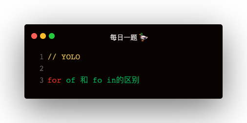

### 解答
for_in 是用于遍历非Symbol类型的可枚举属性   
for_of 是用于遍历迭代对象的   

#### 迭代对象
1. 拥有 Symbol.iterator 属性，值为一个函数
2. iterator 函数返回一个对象，拥有next属性，next值为函数
3. next 函数返回一个对象，有 done 属性和 value 属性，done 代表迭代是否完成，value 代表当前迭代值   

#### for_of 如何迭代普通对象
1. Object.keys
2. Object.values
3. Object.entries
4. 自定义 Symbol.iterator