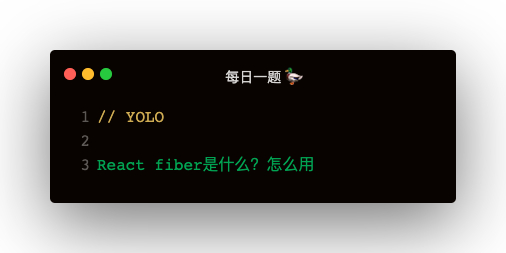

### 为什么需要 React fiber

react v16 之前是通过 树形结构 保存 virtual dom，这种结构有两个问题：
1. 更新任务是不可中止的：比如当前更新到了某个节点，如果任务停止了，那么需要重新进行更新
2. 任务执行时长过长导致丢帧：由于更新任务是不可中止的，时间就很难掌控，当一个 dom tree 节点很多时，执行时间就会很长，比如一帧的时间更长。就可能导致丢帧   

### fiber 是什么
可以理解为 fiber 是一种数据结构，virtual dom 从 树形结构 变成 fiber tree 链表结构

#### 如何实现 fiber 链接结构
树形结构是通过 children 来关联各个节点，通过深度优先遍历的方式进行 diff   
链表结构是通过 child，sibling return 来关联各个节点，通过深度优先遍历的方式以及 firstEffect，nextEffect，effectTag 的配合进行 diff 更新

#### React 原生 fiber
获取渲染的 fiber root
```
document.getElementById('app')._reactRootContainer._internalRoot;
```   

fiber root 结构
```
FiberRootNode {
    - containerInfo: div#app
    - current: FiberNode
        - child:
            - child:
            - return: FiberRootNode
            - sibling: null
            - firstEffect: null
            - lastEffect: null
            - nextEffect: null
            - stateNode: ul.list
        - return: null
        - sibling: null
        - firstEffect: ul
        - lastEffect: ul
        - nextEffect: null
        - stateNode: div#app
    - hydrat: false
}
```   

### 如何实现一个简版 React fiber
React fiber是一个链表结构，所以遍历链表

#### workLoop
```
function workLoop () {
    while (nextUnitOfWork) {
        nextUnitOfWork = performUnitOfWork(nextUnitOfWork)
    }

    // 提交放到最后一起提交，避免部分节点渲染了，部分节点未渲染
    commitRoot()
}
```   

#### performUnitOfWork
两个作用：
1. 开始当前 workInProgress 的工作
2. 返回链表下一个节点: 有儿子返回儿子，没儿子返回叔叔，没叔叔往上走   
3. 当一个节点没儿子时，执行 compeleteUnitOfWork

```
function performUnitOfWork (workInProgress) {
    beginWork(workInProgress)
    if (workInProgress.child) {
        return workInProgress.child
    }
    while (workInProgress) {
        completeUnitOfWork(workInProgress)
        if (workInProgress.sibling) {
            return workInProgress.sibling
        }
        workInProgress = workInProgress.return
    }
}
```   

#### beginWork
两个作用：
1. 创建 stateNode
2. 维护 child，return，sibling，effectTag   

```
function beginWork (workInProgress) {
    if (!workInProgress.stateNode) {
        workInProgress.stateNode = document.createElement(workInProgress.type)
    }
    let prevFiber
    workInProgress.props.children.forEach((child, index) => {
        if (typeof child === 'string') {
            const childEl = document.createElement(child)
            workInProgress.stateNode.appendChild(childEl)
        } else {
            child = {
                ...child,
                return: workInProgress,
                child: null,
                sibling: null,
                effectTag: 'PLACEMENT',
                firstEffect: null,
                lastEffect: null,
                nextEffect: null
            }
            if (index === 0) {
                workInProgress.child = child
            } else {
                prevFiber.sibling = child
            }
            prevFiber = child
        }
    })
}
```   

#### completeUnitOfWork
维护firstEffect，lastEffect, nextEffect   

```
function completeUnitOfWork (workInProgress) {
    const returnFiber = workInProgress.return
    if (!returnFiber.firstEffect) {
        returnFiber.firstEffect = workInProgress.firstEffect
    }
    if (workInProgress.lastEffect) {
        if (returnFiber.lastEffect) {
            returnEffect.lastEffect.nextEffect = workInProgress.lastEffect
        }
        returnEffect.lastEffect = workInProgress.lastEffect
    }
    if (workInProgress.effectTag) {
        if (returnFiber.lastEffect) {
            returnFiber.lastEffect.nextEffect = workInprogress
        } else {
            returnFiber.firstEffect = workInProgress
        }
        returnFiber.lastEffect = workInProgress
    }
}
```   

#### commitRoot
更新UI

```
function commitRoot () {
    const nextEffect = workInProgressRoot.firstEffect
    while (nextEffect) {
        nextEffect.return.stateNode.appendChild(nextEffect.stateNode)
        nextEffect = nectEffect.return
    }
}
```