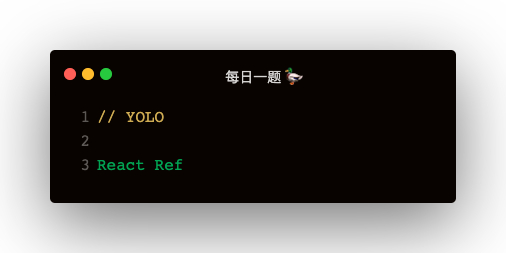

### 解答
最新版本 ref 使用
```
this.inputRef = React.createRef()

<input ref={this.inputRef} />
```

#### ref 引用值
1. 如何 ref={this.inputRef} 加载普通元素上，那么 ref 是 dom 节点
2. 如果它加在子组件上，ref 是子组件实例

#### createRef 实现
```
function createRef () {
    return { current: null }
}
```

#### 函数组件如何使用 Ref
```
const FunctionalComponent = React.forwardRef((props, ref) => {
    return <button ref={ref}>{props.label}</button>
})

this.btnRef = React.createRef();
<FunctionalComponent ref={this.btnRef}>
```

#### forwardRef 自定义实现
```
function forwardRef (FuncComponent) {
    return (props) => {
        const ref = props.ref
        return FuncComponent(props, ref);
    }
}
```