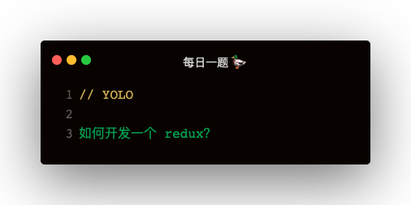

### Redux 的基础应用
基础的四个方法：createStore，getState，subscribe，dispatch
```
function reducer (state, action) {
    switch (action.type) {
        case 'ADD':
            return ++state;
        case 'MINUS':
            return --state;
        default:
            return state;
    }
}
const store = createStore(reducer, initialState);
const unsubscribe = store.subscribe(() => {
    console.log('state发生变化了', store.getState());
})
store.dispatch({ type: 'ADD' });

unsubscribe();
```

#### 基础架构实现
需要注意的点：
1. 如何防止 unsubscribe 多次调用
2. 如何判断是否是个纯对象
```
function createStore (reducer, initialState) {
    let currentState = initialState;
    let currentReducer = reducer;
    let currentListeners = [];

    function getState () {
        return currentState;
    }

    function subscribe (listener) {
        if (typeof listener !== 'function') {
            throw new Error('订阅参数必须为函数')
        }

        let idx = currentListeners.push(listener);
        let isSubscribed = true;
        function unsubscribe () {
            if (!isSubscribe) {
                return
            }
            currentListeners.splice(idx - 1, 1);
            isSubscribe = false
        }
    }

    function dispatch (action) {
        if (!isPlainObject(action)) {
            throw new Error('action 必须是个纯对象')
        }
        if (!action || action.type) {
            throw new Error('action 必须要有一个type属性')
        }
        currentState = currentReducer(currentState, action);
        for (let listener of currentListeners) {
            listener();
        }
    }

    return {
        getState,
        dispatch,
        subscribe,
    }
}
```

#### 纯对象
对象的原型是 Object.prototype
```
function isPlainObject (obj) {
    if (typeof obj !== 'object' || obj === null) {
        return false;
    }
    return Object.getPrototypeOf(obj) === Object.prototype
}
```

### combineReducers
一个 reducer 未免显得有点局促，所有的 action.type 都写在一个里面就很难维护，所以用多个 reducer 维护
```
let initialState = {
    a: {
        num: 1
    },
    b: {
        num: 1
    }
}
function reducerA (state, action) {
    switch (action.type) {
        case 'ADD':
            return ++state.num;
        case 'MINUS':
            return --state.num;
    }
    return state;
}
let reducer = combineReducers({
    a: reducerA,
    b: reducerB
})
const store = createStore(reducer, initialState);
```

combineReducer的实现：
```
function combineReducers (reducers) {
    const reducerNames = Object.keys(reducers);
    return function (state, action) {
        const nextState = {};
        for (let reducerName of reducerNames) {
            const prevStateForKey = state[reducerName];
            const reducer = reducers[reducerName];
            nextState[reducerName] = reducer(prevStateForKey, action);
        }
        return nextState;
    }
}
```   

combineReducers 的原理：
1. 当每次调用 reducer 时，遍历所有 reducers
2. 根据 combineReducers 时传入的 key 和 reducer 映射
3. 从 state 中根据 key 找到对应的 state
4. 从 combineReducers 的参数 reducers 中找到对应的 reducer
5. 执行 reducer(prevStateForKey, actin)，赋值给 nextState[key]
6. 返回 nextState

### applyMiddleware
middleware 的作用就是：拦截 dispatch   

**middleware 的结构：**   
```
const logger = store => next => action => {

}
```

**实现：**   
```
function applyMiddleware (middlewares) {
    return createStore => (reducer, preloadedState) => {
        const store = createStore(reducer, preloadedState);
        let dispatch = () => {
            throw new Error('还不能调用')
        }
        const middlewareAPI = {
            getState: store.getState,
            dispatch: store.dispatch
        }
        middlewares = middlewares.map(middleware => middleware(middlewareAPI));
        dispatch = middlewares.reduce((prev, cur) => {
            return cur(prev);
        }, store.dispatch);
        return {
            ...store,
            dispatch
        }
    }
}
```