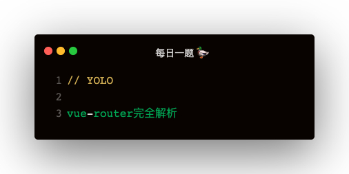

### 思考下 VueRouter 实现根本
1. popstate 或 hashchange 监听路由变化
2. 获取到新的路由，从路由配置中获取对应组件
3. 路由可能有好几层，所以需要匹配到多个组件 matched
4. 获取到新的路由，需要刷新 UI，使用 Vue.util.defineReactive(this, '_route', this.router.history.current)
5. 通过改变 current 中的 path 和 matched 使 UI 刷新
6. Link 组件主要是替换为 a，然后在点击使 preventDefault，然后调用 history.push(this.to) 跳转新路由
7. 调用 history.push 改变路由，会使 hash 等监听到变化，调用 transitionTo 获取新的 current
8. View 组件主要是去获取 history.current, 然后通过 createElement 创建路由对应的 UI
9. 多层路由的情况，需要维护 depth 记录层级，每当实例化 View 时，把当前组件在 $vnode.data.routerView 标记为 true，遍历父组件，每当遇到 routerView: true，depth+1, 从而实现多层级路由

### vue-router如何使用
#### routes声明
每个路由主要是四个属性：name，path，component，children
```
const routes = [
    {
        name: 'Home',
        path: '/home',
        component: Home,
        children: [
            {
                name: 'Tel',
                path: 'tel',
                component: Tel,
            },
            {
                name: 'About',
                path: 'about',
                component: About,
            },
        ],
    },
    {
        name: 'Foo',
        path: '/foo',
        component: Foo,
    },
    {
        name: 'Bar',
        path: '/bar',
        component: Bar,
    }
]
```

#### 通过 routes 实例化 router
```
import VueRouter from 'vue-router'

const router = new VueRouter({
    mode: 'hash | history',
    routes
})
```

#### Vue 使用 router
```
Vue.use(VueRouter)
new Vue({
    router,
    render: h => h(App)
}).$mount('#app')
```

### 实现分析
#### 从 VueRouter 使用分析实现
```
Vue.use(VueRouter)
new VueRouter({
    mode: 'hash',
    routes
})
```   

1. VueRouter 是个类
2. VueRouter 有个静态方法 install

#### 从组件实例属性分析
```
- Root
    - _route
        - path: /home/tel
        - matched: [{ path: '/home', component:... }, { path: '/home/tel', component:... },]
    - _router
        - app
        - history
            - current: { path: '/home/tel', matched:[...] }
            - listeners:
            - router
        - matcher
            - addRoutes
            - match
        - beforeHooks
        - afterHooks
    - _routerRoot
- Home
    - $vnode
        - data
            - routerView: true
    - _routerRoot
```   

1. _routerRoot 是根组件，可以发现每个组件上都维护了 _routerRoot
2. _router 是 VueRouter 实例，只有根组件维护
3. _route 也只有根组件维护，是个匹配器匹配到的结果   

**什么时候来混入 _routerRoot 和 _router 呢？**   
使用原型 Vue.prototype 过于暴力，可以使用 Vue.mixin

#### Vue.mixin 混入 _routerRoot 和 _router
```
VueRouter.install = function (Vue) {
    Vue.mixin({
        beforeCreate () {
            if (this.$options.router) {
                this._routerRoot = this
                this._router = this.$options.router

                this._router.init(this)
                Vue.util.defineReactive(this, '_router', this.router.history.current)
            } else {
                this._routerRoot = this.$parent && this.$parent._routerRoot
            }
        }
    })
}
```

### VueRouter 实现
```
import RouterLink from './components/link'
import RouterView from './components/view'
import HashHistory from './history/HashHistory'
import BrowserHistory from './history/BrowserHistory'
import createMatcher from './matcher/create-matcher'

class VueRouter {
    constructor (options) {
        this.mode = options.mode;
        this.matcher = createMatcher(options.routes);
        switch (this.mode) {
            case 'hash':
                this.history = new HashHistory(this);
                break;
            case 'history':
                this.history = new BrowserHistory(this);
                break;
        }
    }

    init (app) {
        this.app = app;
        const history = this.history;
        history.transitionTo(
            history.getCurrentLocation(),
            history.setupListener.bind(history)
        );
    }

    addRoutes (routes) {
        this.matcher.addRoutes(routes);
    }

    push (location) {
        this.history.push(location)
    }
}

VueRouter.install = function (Vue) {
    Vue.mixin({
        beforeCreate () {
            if (this.$options.router) {
                this._routerRoot = this;
                this._router = this.$options.router

                this._router.init(this)
                Vue.util.defineReactive(this, '_route', this._router.history.current)
            } else {
                this._routerRoot = this.$parent && this.$parent._routerRoot
            }
        }
    })

    Vue.component('router-link', RouterLink);
    Vue.component('router-view', RouterView);
}

export default VueRouter
```

### 路由拍平
```
function createMatcher (routes) {
    let { pathMap } = createPathMap(routes);

    function addRoutes (routes) {
        createPathMap(routes, pathMap);
        console.log('【匹配器】路由拍平：', pathMap)
    }

    function match (path, _route) {
        let matched = []
        let record = pathMap[path]
        if (record) {
            matched.push(record)
            while(record.parent) {
                matched.unshift(record.parent)
                record = record.parent
            }
        }
        _route.path = path
        _route.matched = matched
        return _route;
    }

    console.log('【匹配器】路由拍平：', pathMap)
    return {
        addRoutes,
        match
    }
}

function createPathMap (routes, oldPathMap, parent) {
    let pathMap = oldPathMap || {};
    for (let router of routes) {
        const children = router.children
        const path = parent ? `${parent.path}/${router.path}` : router.path
        pathMap[path] = { ...router, path, parent };
        children && createPathMap(children, pathMap, router);
    }
    return { pathMap }
}

export default createMatcher
```

### history 实现
```
// Base.js
class Base {
    constructor (router) {
        this.router = router
        this.current = {};
    }

    transitionTo (path, handler) {
        this.current = this.router.matcher.match(path, this.current)
        handler && handler();
    }
}

export default Base;


// BrowserHistory.js
import Base from './Base'
class BrowserHistory extends Base {
    constructor (router) {
        super(router)
    }

    getCurrentLocation () {
        return window.location.pathname
    }

    setupListener () {
        window.addEventListener('popstate', () => {
            this.transitionTo(
                this.getCurrentLocation()
            )
        })
    }

    push (location) {
        history.pushState({}, '', location)
    }
}

export default BrowserHistory;


// HashHistory.js
import Base from './Base'
function ensureSlash () {
    if (window.location.hash) {
        return;
    }

    window.location.hash = '/'
}

class HashHistory extends Base {
    constructor (router) {
        super(router)

        ensureSlash()
    }

    getCurrentLocation () {
        return window.location.hash.slice(1)
    }

    setupListener () {
        window.addEventListener('hashchange', () => {
            this.transitionTo(
                this.getCurrentLocation()
            )
        })
    }

    push (location) {
        window.location.hash = location;
    }
}

export default HashHistory;
```

### RouterLink RouterView 组件实现
```
// RouterLink.js
const Link = {
    props: {
        to: String,
    },
    render (h) {
        return h(
            'a',
            {
                attrs: {
                    href: this.to
                },
                on: {
                    click: this.clickEvt
                }
            },
            [
                this.$slots.default
            ]
        )
    },
    methods: {
        clickEvt (e) {
            e.preventDefault();
            this._routerRoot._router.push(this.to);
        }
    }
}

export default Link;


// RouterView.js
const View = {
    functional: true,
    render (createElement, context) {
        let depth = 0;
        let comp = context.parent
        const matched = comp._routerRoot._router.history.current.matched;

        let parent = comp.$parent
        while (parent) {
            const vnode = parent.$vnode
            if (vnode && vnode.data.routerView) {
                depth++
            }
            parent = parent.$parent
        }

        if (Array.isArray(matched)) {
            const router = matched[depth]
            comp.$vnode.data.routerView = true
            if (router) {
                return createElement(router.component)
            }
        }
    }
}

export default View;
```

### 路由守卫
```
// 添加守卫
router.beforeHook((to, from, next) => {
    console.log('路由：', to, from)
    setTimeout(() => {
        console.log(1);
        next();
    }, 1000)
})
router.beforeHook((to, from, next) => {
    console.log('路由：', to, from)
    setTimeout(() => {
        console.log(2);
        next();
    }, 1000)
})


// 在跳转之前，执行守卫，最后再跳转
transitionTo (path, handler) {
    const updateRouter = () => {
        this.current = this.router.matcher.match(path, this.current || {})
        handler && handler();
    }

    const runHooks = () => {
        const from = this.current.path
        const beforeHooks = this.router.beforeHooks
        if (beforeHooks && beforeHooks.length) {
            beforeHooks.reduce((prev, current, idx) => {
                let next = current
                if (idx === (beforeHooks.length - 1)) {
                    next = () => current(path, from, updateRouter)
                }
                return prev ? prev(path, from, next) : current;
            })
        }
    }
    
    (this.current ? runHooks : updateRouter)()
}
```