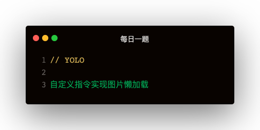

#### 图片懒加载的三种实现方式
##### scroll事件 + getBoundingClientRect
```
const imgs = document.getElementsByTagName('img')
const body = document.body
function imgLoad () {
  for (let img of imgs) {
    const clientRect = img.getBoundingClientRect()
    if (clientRect.bottom < (body.scrollTop + body.clientHeight)) {
      img.src = img.getAttribute('data-src')
      img.style.height = 'auto'
    }
  }
}

function throttle (func, wait) {
  let timer = null
  return function (...args) {
    if (!timer) {
      timer = setTimeout(() => {
        timer = null
        func.apply(this, args)
      }, wait)
    }
  }
}

document.addEventListener('scroll', throttle(imgLoad, 0))

imgLoad()
```

##### InsectionObserver
```
const imgs = document.getElementsByTagName('img')
const intersectionObserver = new IntersectionObserver(function(entries) {
  for (let entry of entries) {
    if (entry.intersectionRatio > 0) {
      const target = entry.target
      target.style.height = 'auto'
      target.src = target.getAttribute('data-src')
      intersectionObserver.unobserve(target)
    }
  }
})
for (let img of imgs) {
  intersectionObserver.observe(img)
}
```

##### 浏览器原生支持loading="lazy"
```

```

#### Vue自定义指令 + 图片懒加载
模版：
```

```   

```
const intersectionObserver = new IntersectionObserver(function(entries) {
  for (let entry of entries) {
    if (entry.intersectionRatio > 0) {
      const target = entry.target
      target.style.height = 'auto'
      target.src = target.getAttribute('data-src')
      intersectionObserver.unobserve(target)
    }
  }
})
directives: {
  lazy: {
    inserted: function (el) {
      intersectionObserver.observe(el)
    }
  }
}
```

##### directive的钩子函数
1. bind：指令第一次绑定到元素时调用
2. inserted：元素插入父节点时调用
3. update：所在组件VNode更新时调用