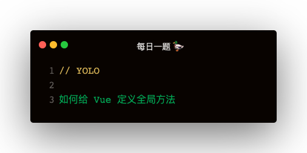

### 解答
#### Vue.prototype
```
Vue.prototype.call = () => console.log('call')
```   

#### mixin 方式
```
const mixin = {
    methods: {
        call () {
            console.log('call')
        }
    }
}
Vue.mixin(mixin)
```   

#### Plugin 方式
```
const plugin = {
    install (Vue) {
        Vue.prototype.$call = () => {
            console.log('call')
        }
    }
}
Vue.use(plugin)
```