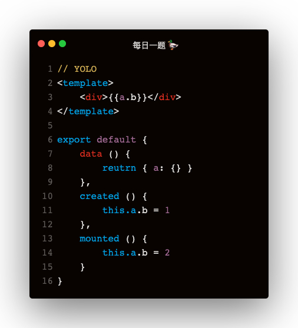

以上代码模版中渲染的是什么值？

### 解答

模版中显示为1

vue实例化的顺序是：
1. initState：observe(options.data)
2. callHook(vm, 'created')
3. vm.$mount
4. callHook(vm, 'mounted')   

**原因：**   
1. 最先执行observe，所以在 created 和 mounted 添加的属性，都不是响应式属性
2. created 在 $mount 之前执行，$mount 挂载时值已经是1，所以渲染时为1
3. mounted 时把 b 改为了2，可是属性没有被 observe，且并没有重新渲染，所以还是1