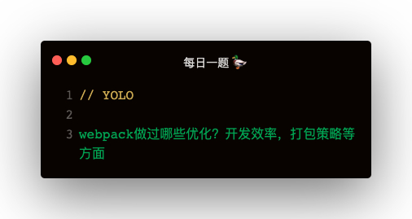

### 解答
#### 优化构建速度
- 1.使用高版本 webpack4
- 2.多线程构建：HappyPack，thread-loader
- 3.缩小打包作用域   
    - 3.1.exclude / include 配置loader规则范围   
    - 3.2.resolve   
        - 3.2.1.modules 指明第三方模块的绝对路径（减少不必要的查找）   
        - 3.2.2.extensions 尽可能减少后缀尝试的可能性
    - 3.3.noParse 对不需要解析的库进行忽略（不解析但仍会打包入bundle，被忽略的文件不应该出现import，require，define等模块化语句）
    - 3.4 ignorePlugin 完全排除模块
    - 3.5 合理使用alias
- 4.充分利用缓存提升二次构建速度
    - 4.1.babel-loader开启缓存
    - 4.2.terser-webpack-plugin 开启缓存
    - 4.3.使用 cache-loader 或者 hard-source-webpack-plugin
- 5.DLL：使用 DllPlugin 进行分包，使用 DllReferencePlugin 对 manifest.json 进行引用，避免反复编译浪费时间

##### webpack4的优化
1. V8带来的优化：for of 替代 forEach，Map Set 替代 Object，includes 替代 indexOf
2. 默认使用更快的 md4 hash 算法
3. webpack AST 直接从 loader 传递给 AST，减少解析时间
4. 使用字符串方法替代正则表达式

##### noParse
```
    module: {
        noParse: /jquery/,
        rules: []
    }
```

##### ignorePlugin
```
// 从 moment 引用 ./local 忽略掉
new Webpack.IgnorePlugin(/./local/, /moment/)

// 使用 moment 的时候
import 'moment/locale/zh-cn'
```   

##### 压缩加速
```
// UglifyJsPlugin
optimization : {
    minimizer: [
        new UglifyJsPlugin({
            parallel: true
        })
    ]
}

// TerserPlugin
optimizition: {
    minimizer: [
        new TerserPlugin({
            parallel: true
        })
    ]
}
```   

#### 优化打包体积
##### 压缩代码
1. webpack-parallel-uglify-plugin
2. uglify-webpack-plugin 