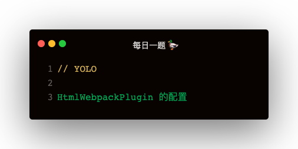

### 解答
#### filename
```
new HtmlWebpackPlugin({
    filename: 'order/index.html'
})
```

#### title
```
new HtmlWebpackPlugin({
    title: 'Hello Webpack'
})

<%= htmlWebpackPlugin.options.title %>
``` 

#### template
```
new HtmlWebpackPlugin({
    template: 'template.html'
})
```

#### templateContent
inline html

#### templateParameters
```
new HtmlwebpackPlugin({
    templateParameters: {
        __base_style__: '<style> .app { red } </style>'
    }
})
```

#### inject
```
inject: true | false | head | body

true 跟 body 效果一样：在body末尾注入
false：不注入 js
head：在 head 中注入 js
```  

#### publicPath
跟 output publicPath，在输出 js 路径加入 publicPath


#### scriptLoading
1. blocking： 正常注入 js
2. defer：注入 js 添加 defer 属性


```
scriptLoading: blocking | defer
```   

#### favicon
注入 favicon，⚠️ ：需要是本地的，会带上 publicPath 前缀

#### minify
压缩，true | false

#### hash
js css icon 都会带上 ?hash，可有效清楚缓存

#### chunks
注入哪些 js
```
chunks: ['main']
```

#### chunksSortMode
```
// 插入 html 的很多 chunks，如何排序
chunks: ['index', 'main'],
chunksSortMode: 'auto | manual'
```

#### excludeChunks
不包含的 chunks