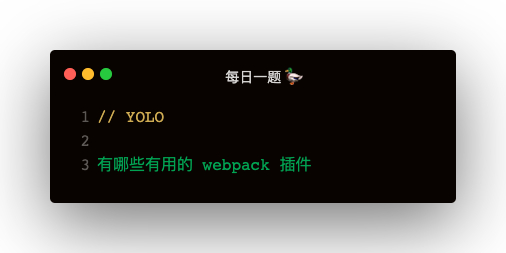

## Loader

### loader 的使用方式
如果不在 webpack.config.js 中配置 loader，那么怎么使用呢？
```
require('style-loader!css-loader!./index.css')
```

### file-loader 处理文件
1. 把原图片拷贝到 dist，文件名也会变
2. 可以处理任意二进制数据   

```
require('file-loader?outputPath=./images!./1.jepg')

{
    test: /.png/,
    use: {
        loader: 'file-loader',
        options: {
            outputPath: '/images'
        }
    }
}
```   

### 全局注入方案二：expose-loader
这样使用，需要手动 import jquery from 'jquery'；当 require 解析到这个 import 时，就会走 expose-loader   
**但是好处是：只会在一个文件中打包**
```
{
    test: require.resolve('jquery'),
    use: {
        loader: 'expose-loader',
        options: {
            exposes: {
                globalName: '$',
                override: true
            }
        }
    }
}
```

### babel-loader
babel非常慢，优化主要通过以下两点：
1. exclude 或者 include 精确解析
2. cacheDirectory: true 开启缓存

```
{
    test: /.js$/,
    use: {
        loader: 'babel-loader',
        options: {
            presets: ['@babel/preset-env']
        }
    }
}
```

### cache-loader
```
{
    test: /\.js$/,
    use: [
        'cache-loader',
        'babel-loader'
    ],
    include: path.resolve('src')
}
```

### css-loader
css-loader 解释 @import 和 url()

## Plugins

### CleanWebpackPlugin
开发时 dist 目录不断产出，文件很多很乱
```
const CleanWebpackPlugin = require('clean-webpack-plugin')
new CleanWebpackPlugin(['dist'])
```   

不带参数的话，会把 output path 作为目标目录

### 全局注入方案一：ProvidePlugin
缺点：比如 $: jquery，使用到 $ 的模块都会打包jquery，造成重复打包   

配置 noParse 也没用
```
const webpack = require('webpack')
new webpack.ProvidePlugin({
    $: 'jquery'
})
```

### extract-text-webpack-plugin
```
const ExtractTextWebpackPlugin = require('extract-text-webpack-plugin')
{
    test: /\.css$/,
    use: ExtractTextWebpackPlugin.extract({
        fallback: 'style-loader',
        use: 'css-loader'
    })
}

plugins: [
    new ExtractTextPlugin('style.css'),
]
```   

**多个 css 模块 如何处理？**
```
const lessExtractPlugin = new ExtractTextWebpackPlugin('css/less.css')
const cssExtractPlugin = new ExtractTextWebpackPlugin('css/css.css')
const sassExtractPlugin = new ExtractTextWebpackPlugin('css/sass.css')

// 加载器以此类推
{
    test: /\.css$/,
    use: cssExtractPlugin.extract({
        fallback: 'style-loader',
        use: 'css-loader'
    })
}

plugins: [
    lessExtractPlugin,
    cssExtractPlugin,
    sassExtractPlugin,
]
```   

### CopyWebpackPlugin
```
const CopyWebpackPlugin = require('copy-webpack-plugin')

new CopyWebpackPlugin({
    from: path.join(__dirname, 'public'),
    to: path.join(__dirname, 'dist')
})
```   

### AggressiveSplittingPlugin
```
new webpack.optimize.AggressiveSplittingPlugin({
    minSize: 30000,
    maxSize: 50000,
    chunkOverhead: 0,

})
```