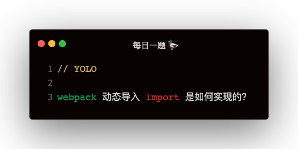

### 解答
#### 动态导入 import 使用
```
// index.js
document.getElementById('app').addEventListener('click', () => {
    import('./console.js').then(_console => {
        _console.log('clicked')
    })
})

//console.js
function log (msg) {
    console.log(`system log: ${msg}`)
}
export {
    log
}
```

#### webpack 打包之后的样子
```
// main.js
{
    './index.js': function (module, __webpack_exports__, __webpack_require__) {
        document.getElementById('app').addEventListener('click', () => {
            __webpack_require__.e(0).then(
                __webpack_require__.bind(null, './console.js')
            ).then(_console_ => {
                _console_.log('clicked')
            })
        })
    }
}

// 0.js
window.webpackJsonp = window.webpackJsonp || []
window.webpackJsonp.push([
    [0],
    {
        './console.js': function (module, __webpack_exports__, __webpack_require__) {
            Object.defineProperty(__webpack_exports__, 'log', {
                enumerable: true,
                get: function () {
                    return log
                }
            })
            function log (msg) {
                console.log(msg)
            }
        }
    }
])
```   

#### __webpack_require__ 的实现
```
(function (modules) {
    var installedModules = {};

    function __webpack_require__ (moduleId) {
        if (installedModules[moduleId]) {
            return installedModules[moduleId]
        }

        var module = installedModules[moduleId] = {
            i: moduleId,
            l: false,
            exports: {}
        }

        modules[moduleId].call(module, module, module.exports, __webpack_require__)
        module.l = true

        return module.exports
    }
})({
    './index.js': function (){}
})
```   

#### __webpack_require__.e的实现
```
var installedChunks = {}
__webpack_require__.e = function requireEnsuer (chunkId) {
    var promises = []
    var installedChunkData = installedChunks[chunkId]
    if (installedChunkData !== 0) {
        if (installedChunkData) {
            promises.push(installedChunkData[2])
        } else {
            var promise = new Promise((resolve, reject) => {
                installedChunkData = installedChunks[chunkId] = [resolve, reject]
            })
            promises.push((installedChunkdata[2] = promise))

            var script = document.createElement('script')
            script.src = `${chunkId}.js`
            document.head.appendChild(script)
        }
    }
    return Promise.all(promises)
}
```

#### window.webpackJsonp 是什么？
window.webpackJsonp 是个数组，但是传统 jsonp 应该是调用回调函数，可是打包之后代码为什么是：window.webpackJsonp.push，如何触发回调呢？
```
var jsonpArray = window.webpackJsonp = window.webpackJsonp || []
var parentJsonpFunction = jsonpArray.push.bind(jsonArray)
jsonpArray.push = webpackJsonpCallback
for (let jsonp of jsonpArray) {
    webpackJsonpCallback(jsonp)
}
```   

可以看出 window.webpackJsonp.push，如果在main.js已加载的情况下，其实已经是 webpackJsonpCallback 函数了

#### webpackJsonpCallback 的实现
```
function webpackJsonpCallback (data) {
    const chunkIds = data[0]
    const moreModules = data[1]
    vat resolves = []

    for (let chunkId of chunkIds) {
        resolves.push(installedChunks[chunkId][0])
        installedChunks[chunkId] = 0
    }

    for (let moduleName in moreModules) {
        modules[moduleName] = moreModules[moduleName]
    }

    if (parentJsonpFunction) parentJsonpFunction(data)

    while (resolves.length) {
        resolves.shift()()
    }
}
```