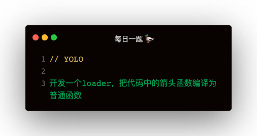

### 解答

```
const transformer = require("@babel/core");
const t = require('@babel/types')

module.exports = function(content, map, meta) {
    const ArrowFunctionToFunctionPlugin = {
        visitor: {
            ArrowFunctionExpression(path) {
                const ruturnStatement = t.returnStatement(path.node.body)
                const blockStatement = t.blockStatement([ruturnStatement])
                const funcExpr = t.functionExpression(null, path.node.params, blockStatement)
                path.replaceWith(funcExpr)
            }
        }
    }

    const result = transformer.transform(content, {
        plugins: [ArrowFunctionToFunctionPlugin]
    })

    return result.code
}
```   

#### loader的配置
```
resolveLoader: {
    modules: [path.resolve(__dirname, 'loaders')],
    extensions: ['.js'],
    mainFields: ['loader']
}
```