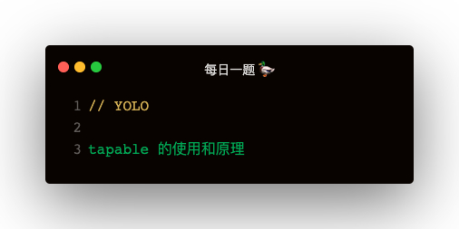

### 解答
#### SyncHook
```
const { SyncHook } = require('tapable')

const queue = new SyncHook(['n', 'a', 's'])
queue.tap('1', function (name, age, sex) {
    console.log(name, age, sex)
})
queue.tap('2', function (name, age) {
    console.log(name, age)
})
queue.tap('3', function (name, age) {
    console.log(name, age)
})

queue.call('1', 'xiur', 29, 'man')
```   

自定义实现:
```
class SyncHook {
    constructor () {
        this._plugins = {}
    }
    tap (name, callback) {
        (this._plugins[name] || (this._plugins[name] = [])).push(callback)
    }
    call (...args) {
        for (let pluginName in this._plugins) {
            let plugins = this._plugins[pluginName]
            for (let plugin of plugins) {
                plugin.apply(this, args)
            }
        }
    }
}

module.exports = SyncHook
```

#### SyncBailHook
```
const { SyncBailHook } = require('tapable')

const queue = new SyncBailHook(['n', 'a', 's'])
queue.tap('1', function (name, age, sex) {
    console.log(name, age, sex)
    return 'Wrong'
})
queue.tap('2', function (name, age) {
    console.log(name, age)
})
queue.tap('3', function (name, age) {
    console.log(name, age)
})

queue.call('1', 'xiur', 29, 'man')
```

自定义实现：
```
class SyncBailHook {
    constructor () {
        this._plugins = {}
    }
    tap (name, callback) {
        (this._plugins[name] || (this._plugins[name] = [])).push(callback)
    }
    call (...args) {
        for (let pluginName in this._plugins) {
            let plugins = this._plugins[pluginName]
            for (let plugin of plugins) {
                let result = plugin.apply(this, args)
                if (result) {
                    return result
                }
            }
        }
    }
}

module.exports = SyncBailHook
```

#### SyncWaterfallHook
```
const { SyncWaterfallHook } = require('tapable')

const queue = new SyncWaterfallHook(['n', 'a', 's'])
queue.tap('1', function (name, age, sex) {
    console.log(name, age, sex)
    return name + '1'
})
queue.tap('2', function (name, age) {
    console.log(name, age)
    return name + '2'
})
queue.tap('3', function (name, age) {
    console.log(name, age)
    return name + '3'
})

queue.call('xiur', 29, 'man')
```

自定义实现：
```
class SyncWaterfallHook {
    constructor () {
        this._plugins = {}
    }
    tap (name, callback) {
        (this._plugins[name] || (this._plugins[name] = [])).push(callback)
    }
    call (init, ...args) {
        let current = init
        for (let pluginName in this._plugins) {
            let plugins = this._plugins[pluginName]
            for (let plugin of plugins) {
                current = plugin.apply(this, [current, ...args])
            }
        }
    }
}

module.exports = SyncWaterfallHook
```

#### SyncLoopHook
```
const { SyncLoopHook } = require('tapable')

const queue = new SyncLoopHook(['n', 'a', 's'])

let count = 3;
queue.tap('1', function (name, age, sex) {
    console.log(count)
    if (count > 0) {
        count--;
        return count
    } else {
        return
    }
})

queue.call('xiur', 29, 'man')
```

自定义实现：
```
class SyncLoopHook {
    constructor () {
        this._plugins = {}
    }
    tap (name, callback) {
        (this._plugins[name] || (this._plugins[name] = [])).push(callback)
    }
    call (...args) {
        for (let pluginName in this._plugins) {
            let plugins = this._plugins[pluginName]
            for (let plugin of plugins) {
                let result
                do {
                    result = plugin.apply(this, args)
                } while (result !== undefined)
            }
        }
    }
}

module.exports = SyncLoopHook
```

#### AsyncParalleHook 异步并行加载
```
// const { AsyncParallelHook } = require('tapable')
const AsyncParallelHook = require('./AsyncParallelHook')

const hook = new AsyncParallelHook(['name']);
console.time('cost');

hook.tapAsync('a', (name, cb) => {
    setTimeout(() => {
        console.log(`hello ${name}`);
        cb();
    }, 2000)
})

hook.tapPromise('a', name => {
    return new Promise((resolve) => {
        setTimeout(() => {
            console.log(`hello ${name}, again`);
            resolve();
        }, 4000)
    })
})

hook.callAsync('a', () => {
    console.log('done');
    console.timeEnd('cost');
});

```

自定义实现：
```
class AsyncParallelHook {
    constructor () {
        this._plugins = {};
    }
    tapAsync (name, callback) {
        (this._plugins[name] || (this._plugins[name] = [])).push(function (...args) {
            const cb = args.pop();
            callback.call(this, ...args, () => {
                ++this.i;
                if (this.i >= this._plugins[name].length) {
                    return cb()
                }
            });
        })
    }
    tapPromise (name, callback) {
        (this._plugins[name] || (this._plugins[name] = [])).push(function (...args) {
            callback.apply(this, args).then(() => {
                const cb = args.pop();
                ++this.i;
                if (this.i >= this._plugins[name].length) {
                    return cb()
                }
            })
        })
    }
    callAsync (...args) {
        this.i = 0;
        for (let pluginName in this._plugins) {
            let plugins = this._plugins[pluginName]
            for (let plugin of plugins) {
                plugin.apply(this, args)
            }
        }
    }
}

module.exports = AsyncParallelHook
```

#### AsyncSeriesHook 异步串行加载
```
const { AsyncSeriesHook } = require('tapable');

const hook = new AsyncSeriesHook(['name']);

console.time('cost');

hook.tapAsync('a', (name, cb) => {
    setTimeout(() => {
        console.log(`hello ${name}`);
        cb();
    }, 2000);
});
hook.tapPromise('a', (name) => {
    return new Promise((resolve) => {
        setTimeout(() => {
            console.log(`hello ${name}, again`);
            resolve();
        }, 4000);
    });
});

hook.callAsync('a', () => {
    console.log('done');
    console.timeEnd('cost');
});
```

自定义实现：
```
class AsyncSeriesHook {
    constructor () {
        this._plugins = {}
        this.next = this._next.bind(this)
    }
    tapAsync (name, callback) {
        (this._plugins[name] || (this._plugins[name] = [])).push(function (...args) {
            const cb = args.pop();
            callback(...args, () => this.next(name, cb, [...args, cb]));
        })
    }
    tapPromise (name, callback) {
        (this._plugins[name] || (this._plugins[name] = [])).push(function (...args) {
            const cb = args.pop();
            callback(...args).then(() => this.next(name, cb, [...args, cb]))
        })
    }
    _next (name, cb, args) {
        ++this.i;
        if (this.i >= this._plugins[name].length) {
            return cb();
        }
        this._plugins[name][this.i].apply(this, args)
    }
    callAsync (...args) {
        this.i = 0
        for (let pluginName in this._plugins) {
            let plugins = this._plugins[pluginName];
            if (plugins) {
                plugins[0].apply(this, args)
            }
        }
    }
}

module.exports = AsyncSeriesHook
```

#### AsyncSeriesBailHook 异步串行熔断加载
```
const { AsyncSeriesHook } = require('tapable');

const hook = new AsyncSeriesHook(['name']);

console.time('cost');

hook.tapAsync('a', (name, cb) => {
    setTimeout(() => {
        console.log(`hello ${name}`);
        cb('yes');
    }, 2000);
});
hook.tapPromise('a', (name) => {
    return new Promise((resolve) => {
        setTimeout(() => {
            console.log(`hello ${name}, again`);
            resolve('yes');
        }, 4000);
    });
});

hook.callAsync('a', () => {
    console.log('done');
    console.timeEnd('cost');
});
```

```
class AsyncSeriesBailHook {
    constructor () {
        this._plugins = {}
        this.next = this._next.bind(this)
    }
    tapAsync (name, callback) {
        (this._plugins[name] || (this._plugins[name] = [])).push(function (...args) {
            const cb = args.pop();
            callback(...args, ret => this.next(name, cb, [...args, cb], ret));
        })
    }
    tapPromise (name, callback) {
        (this._plugins[name] || (this._plugins[name] = [])).push(function (...args) {
            const cb = args.pop();
            callback(...args).then(ret => this.next(name, cb, [...args, cb], ret))
        })
    }
    _next (name, cb, args, ret) {
        ++this.i;
        if (this.i >= this._plugins[name].length || ret !== undefined) {
            return cb();
        }
        this._plugins[name][this.i].apply(this, args)
    }
    callAsync (...args) {
        this.i = 0
        for (let pluginName in this._plugins) {
            let plugins = this._plugins[pluginName];
            if (plugins) {
                plugins[0].apply(this, args)
            }
        }
    }
}

module.exports = AsyncSeriesBailHook
```