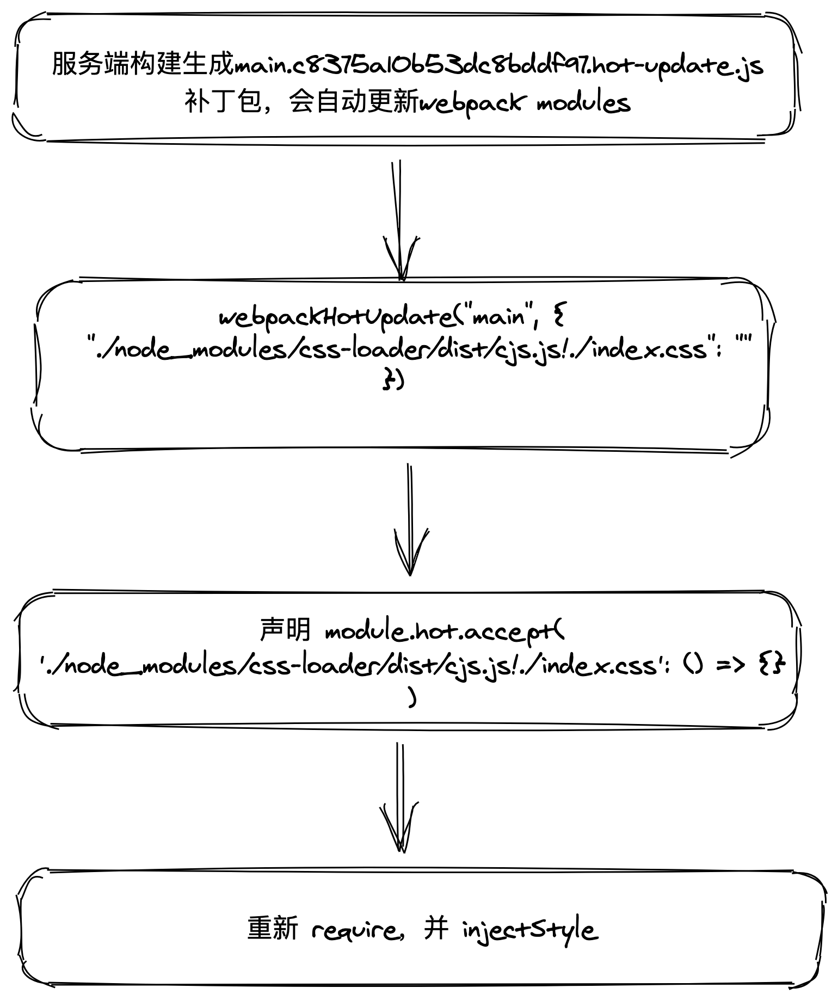

### style-loader 的作用
1. 把 css 插入 html
2. 开发阶段模块热更新

### style-loader 和 css-loader 的关系
style-loader 和 css-loader 经常一起使用，那么不使用 css-loader，只用 style-loader 加载 css 行不行呢？答案是不行的 🙅‍♂️ 
1. style-loader 只是把 css 插入 html，但是并不会解析 css 文件
2. 那么 webpack 是不认识 css 文件的，需要 css-loader 来加载 css文件
3. css-loader 换成 less-loader 也是成立的，其作用就是加载 css 文件   

### 试想一下 实现 style-loader需要解决什么问题
1. 如何拿到 css-loader 解析之后的源码？
2. 如何避免 css-loader 的重复执行【死循环】？
3. 如何支持热更新？

**可以实行的一种方案：**   
1. 每次热更新，比如更新了 index.css，网页端会收到一个补丁包：./node_modules/css-loader/dist/cjs.js!./index.css，网页端收到补丁包，会去更新这个模块
2. 客户端监听 module.hot.accept('./node_modules/css-loader/dist/cjs.js!./index.css', function () {})
3. 回调函数中，重新获取这个模块然后进行更新
5. 更新过程中，如何找到最初的那个 style 节点，客户端就需要用一个映射来保存 styleInDom，映射的值为更新函数，键是啥？
6. 加载 index.css 插入到 html，那么 index.css 这个名称就可以作为 key

### 从 style-loader 的使用分析原理
style-loader 的应用场景：
```
loader: ['style-loader', 'css-loader']
```   

webpack loader 的执行路径：
```
| - style-loader  `pitch`
	| - css-loader  `pitch`
		| - requested module is picked up as a dependency
	| - css-loader  normal execution
| - style-loader  normal execution
```   

#### css-loader 返回结果分析
css-loader 加载 css 之后，loader 的 source 如下：
```
// Imports
var ___CSS_LOADER_API_IMPORT___ = require("../node_modules/css-loader/dist/runtime/api.js");
var ___CSS_LOADER_EXPORT___ = ___CSS_LOADER_API_IMPORT___(function(i){return i[1]});

// Module
___CSS_LOADER_EXPORT___.push([module.id, "nbody {n    background: yellow;n}n", ""]);

// Exports
module.exports = ___CSS_LOADER_EXPORT___;
```   

**从这个结果来看，在 style-loader 中需要对 source 进行 require 模块导入，然后才能拿到其中的 css**   
1. 在 loader 中 require 导入其他模块不规范
2. 过程很复杂

所以采用 pitch 的方式

### pitch
pitch 可以拦截 loader，pitch 中 return 会导致后续的 loader 不执行

#### pitch 的写法
```
module.exports.pitch = function (remainingRequest, precedingRequest, data) {
    remainingRequest： 剩下的请求
    precedingRequest：已处理的请求
    data：数据
}
```   

style-loader 首先需要拿到 css-loader 的处理结果：
```
module.exports = function (remainingRequest) {
    const remainingPath = loaderUtils.stringifyRequest(this, `!!${remainingRequest}`)
    return `
        import content from ${remainingPath}
    `
}
```   
这样就拿到 css-loader 处理之后的数据了。如下：
```
[
    0: [
        0: "./node_modules/css-loader/dist/cjs.js!./index.css"
        1: "body { color: red}",
        2: ""
    ],
    i: (modules, mediaQuery, dedupe) => {},
    length: 1
]
```   

从这个数据中，可以看出：0 可以作为 id，1 可以作为css

#### 模块热更新的写法
```
webpack.config.js 中配置 devServer
devServer: {
    hot: true
}

每个需要支持热更新的模块声明 module.hot.accept
if (module.hot) {
    module.hot.accept('./index.css', function () {
        console.log('halo! css changed')
    })
}
```   
可以看出我们的代码中是没有声明 module.hot.accept 的，可是 css 却支持热更新，说明 loader 中注入了accept

#### accept 注入
accept 中重新获取css
```
if (module.hot) {
    module.hot.accept(remainingPath, function () {
        try {
            const newContent = require(remainingPath);
            // 拿到新的内容，重新走渲染
            injectStyle(newContent);
        } catch (e) {
            console.log('热更新发生错误：', e)
        }
    })
}
```    
**这里用try catch包起来，因为如果这个回调里报错，webpack会走 reload 导致页面刷新**

#### 利用闭包
哪些变量用到了闭包呢：styleInDom，updater，style
```
function injectStyle (content) {
    for (let item of content) {
        const id = item[0];
        const updater = styleInDom[id];
        const css = item[1];
        // 如果已经渲染过，拿到 updater 方法，该方法中利用闭包缓存了 style 节点，替换 style 中内容即可
        if (updater) {
            updater(css);
        } else {
            styleInDom[id] = addStyle(css)
        }
    }
}

function addStyle (css) {
    const style = ducument.createElement('style');
    style.appendChild(document.createTextNode(css));
    document.head.appendChild(style);

    return function updater (css) {
        if (css) {
            while (style.firstChild) {
                style.removeChild(style.firstChild);
            }
            style.appendChild(document.createTextNode(css));
        } else {
            style.parentNode.removeChild(style);
            delete styleInDom[id]
        }
    }
}
```   
这里不管第一次渲染，还是之后的热更新，每次 injectStyle 就行了，传入 css-loader 转换之后的结果

### 总结

