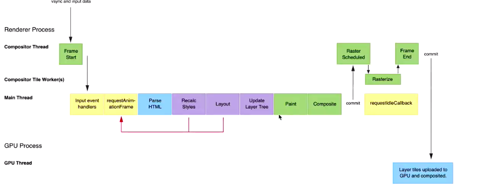

### 渲染性能

问题：
1. 

#### 帧的概念
现在广泛使用的屏幕都有固定的刷新率（最新的一般在60Hz），在两次硬件刷新之间浏览器进行两次重绘是没有意义的只会消耗性能

> 渲染帧   

指浏览器一次完整绘制过程

- 帧之间的时间间隔是DOM视图更新的最小间隔
  - 是否意味着DOM视图更新最小时间为16ms
- 主流浏览器屏幕刷新率为60Hz，渲染一帧的时间必须控制在16ms之内才能保证不掉帧
  - 浏览器执行一次渲染主要是做几件事，如下图

   

浏览器每帧处理流程：
1. input event handlers: 处理事件回调，比如scroll等
2. requestAnimationFrame: 回调函数在下一次重绘之前执行
3. Parse HTML: 生成DOM tree
4. Recalc Styles: 级联地生成每个节点地生效样式
5. Layout: 整合DOM tree和style tree，生成layout tree
6. Update Layer tree: 解析层叠上下文，生成layer tree
7. Paint: 各层分别进行绘制
8. Composite: 合成各层的渲染结果

### 掉帧的概念