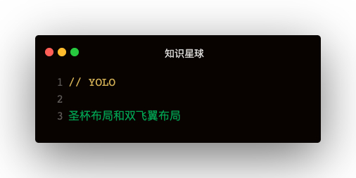

### 解答
圣杯：
```
<div
  style="padding-left: 100px;padding-right: 100px;box-sizing: border-box;width: 100%;height: 100px">
  <div style="width: 100%;height: 100%;background-color: darkgray;float: left;">Main</div>
  <div style="float: left;width: 100px;height: 100%;background-color: rebeccapurple;margin-left: -100%;position: relative;left: -100px;">Left</div>
  <div style="float: left;width: 100px;height: 100%;background-color: rebeccapurple;margin-left: -100px;position: relative;right: -100px;">Left</div>
</div>
```   

双飞翼
```
<div style="width: 100%;height: 100px;background-color: rebeccapurple;">
  <div style="width: 100%;height: 100%;float: left;background-color: salmon;">
      <div style="margin: 0 100px;background-color: red;height: 100%;">1</div>
  </div>
  <div style="width: 100px;height: 100%;float: left;background-color:seagreen;margin-left: -100%;">left</div>
  <div style="width: 100px;height: 100%;float: left;background-color:darkgray;margin-left: -100px;">right</div>
</div>
```