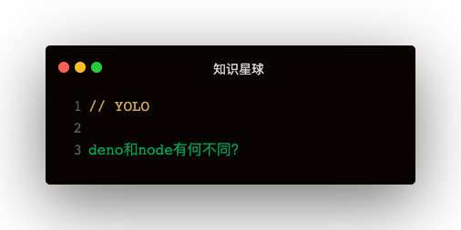

个人理解：Deno并不是下一代Node，更类似浏览器


### Node的问题，作者重写deno的初衷
1. ES6标准引入了大量新的语法特性：Promise接口，async函数和ES模块，node的模块格式CommonJS与ES模块不兼容，迟迟无法完全支持ES模块
2. node的模块管理工具npm，逻辑越来越复杂，node_modules极其庞杂
3. node几乎没有任何安全措施，只要下载了外部模块，就只好听任别人的代码在本地运行，进行各种读写操作
4. node功能不完整，外部工具层出不穷，让开发者疲劳不堪：webpack，babel等

### deno与node的异同

- 安全性
  - 与Node相反，Deno默认在沙箱中执行代码：运行时无权访问
    - 文件系统：allow-write, allow-read
    - 网络：allow-net
    - 执行其他脚本，环境变量...
- 模块
  - 通过url导入代码
    - 不需要node_modules
    - 一旦下载无需重新下载，缓存存储在本地磁盘上，直到--reload再重新下载
- 浏览器兼容性
  - 支持WEB API，尽量跟浏览器保持一致
    - 提供window全局对象
    - 支持fetch，worker等WEB标准
    - 支持onload，onunload，addEventListener等事件操作函数
  - deno所有的异步操作，一律返回Promise
  - deno只支持ES模块，不支持CommonJS模块（没有require命令）


### 骚操作：
#### 一直使用url导入很麻烦
方案一：
```
<!-- dep.js -->
export * from "https://deno.land/std/testing/mod.ts";

<!-- 其他使用test的文件 -->
import { test } from './dep.ts'
```   

方案二：
```
<!-- 创建一个导入映射json -->
{
  "import": {
    "http/": "https://deno.land/std/http/"
  }
}

<!-- 其他使用的文件 -->
import { server } from "http/server.ts"

<!-- importmap指定导入映射 -->
deno run --importmap=import_map.json index.ts
```