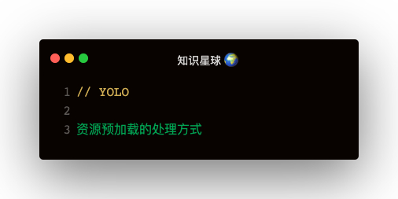

#### preload
```
<link rel="preload" href="http://1.js" as="script" />
```   

link rel href as实现文件的预加载   

as的取值：
1. audio：音频文件
2. document：嵌入frame或iframe内部的文档
3. embed：嵌入embed元素内部的资源
4. fetch：将通过fetch或ajax请求获取的资源，如json文件或ArrayBuffer
5. font：字体文件
6. image：图片文件
7. object：嵌入embed元素内的文件
8. script：js文件
9. style：样式表
10. worker：一个js的web worker或shared worker
11. video：视频文件

#### prefetch
rel为prefetch时，表示下载资源为下一个导航/页面使用