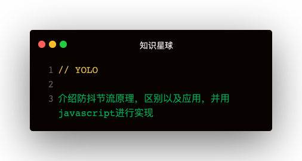

### 解答

#### 防抖
##### 原理   
在事件被触发n秒后再执行回调，如果在这n秒内又被触发，则重新计时⌛️   

##### 场景   
1. 按钮重复点击：防止多次提交按钮，只执行最后一次提交
2. 搜索框联想：防止联想发送请求，只发送最后一次输入

##### 简易版实现   
```
const debounce = fn => {
    let _timeout;
    return function (...args) {
        const context = this
        clearTimeout(_timeout)
        _timeout = setTimeout(() => {
            fn.apply(context, args)
        }, 1000)
    }
}
```

有些时候希望立即执行，然后等到n秒后才可以重新触发
##### 升级版
```
const debounce = (fn, wait, immediate) => {
    let timeout
    return function (...args) {
        const context = this
        if (immediate) {
          timeout = setTimeout(() => {
            timeout = null
          }, wait)
          !timeout && fn.apply(context, args)
        } else {
          _timeout = setTimeout(() => {
              fn.apply(context, args)
          }, wait)
        }
    }
}
```   

#### 节流
##### 原理
规定在一个单位时间内，只能触发一次函数，如果这个单位时间内触发多次函数，只有一次生效   

##### 使用场景
1. 拖拽场景：固定时间内只执行一次，防止超高频次触发位置变动
2. 缩放场景：监控浏览器size

##### 使用时间戳实现
```
function throttle (func, wait) {
    let previous = 0
    return function (...args) {
      const now = Date.now()
      if (now - previous > wait) {
        func.apply(this, args)
        previous = now
      }
    }
}
```   

##### 使用定时器实现
```
function throttle (func, wait) {
    let timeout
    return function (...args) {
      const context = this
      if (!timeout) {
        timeout = setTimeout(() => {
          timeout = null
          func.apply(context, args)
        }, wait)
      }
    }
}
```