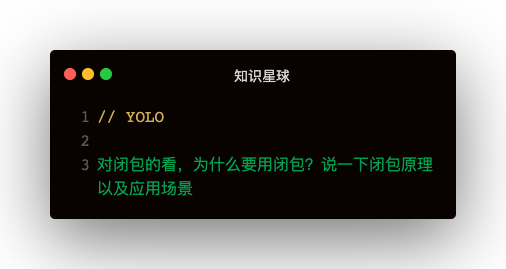

### 解答
#### 什么是闭包？
函数内部返回结果是一个内部函数，并被外部变量所引用，如果内部函数持有被执行函数作用域的变量，即形成了闭包   

#### 闭包的原理
函数执行分为两个阶段：
- 预编译阶段
  - 如果发现内部函数使用了外部函数的变量，会在内存中创建一个闭包对象并保存对应的变量值
- 执行阶段
  - 执行完后，函数执行上下文会被销毁，函数对闭包对象的引用也会被销毁，但其内部函数还持用该闭包的引用，所以内部函数可以继续使用外部函数中的变量   

利用了函数作用域链的特性，一个函数内部定义的函数会将包含外部函数的活动对象添加到它的作用域中，函数执行完毕，其执行作用域销毁，但因内部函数的作用域链仍然在引用这个活动对象，所以其活动对象不会被销毁，直到内部函数被销毁后才能被销毁

#### 优点
1. 可以从内部函数访问外部函数作用域中的变量，且访问到的变量长期驻扎在内存中，可供之后使用
2. 避免变量污染全局
3. 把变量存到独立的作用域，作为私有成员存在

#### 缺点
1. 对内存消耗有负面影响，因内部函数保存了对外部变量的引用，导致无法被垃圾回收，增大内存使用量，所以使用不当会导致内存泄漏。可将内层函数对象的变量赋值为null来释放内存
2. 对处理速度具有负面影响，闭包的层级决定了引用的外部变量在查找时经过的作用域链长度
3. 可能获取到意外的值

#### 应用场景
- 模块封装：自执行函数
- 在循环中创建闭包，防止取到意外的值
  - for + var + setTimeout
  - for + onclick等事件