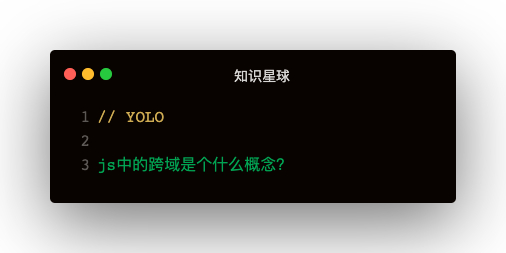

### 解答

浏览器将CORS请求分成两类：简单请求，非简单请求

#### 简单请求
##### 简单请求条件
满足两个条件：
- 请求方式是以下三种：
  - HEAD
  - GET
  - POST
- HTTP的头信息不超过以下几种：
  - Accept
  - Accept-Language
  - Content-Language
  - Last-Event-ID
  - Content-type: 
    - application/x-www-form-urlencoded
    - application/form-data
    - text/plain

这是为了兼容表单，历史上表单一直可以发出跨域请求   
**Ajax的设计就是：只要表单可以发，Ajax就可以直接发**

##### 简单请求流程
浏览器直接发出CORS请求，在头信息中增加一个Origin字段   
Origin：http://api.bob.com:8080   

Origin字段用来说明：本次请求来自哪个源（协议+域名+端口）   

**如果Origin指定的源不在许可范围内**   
服务器会返回一个正常的HTTP响应，浏览器会发现response的头信息没有包含Access-Control-Allow-Origin字段，就知道错了，从而抛出一个错误，被XMLHttpRequest的onerror回调函数捕获   
这种错误无法通过状态码识别，因为HTTP回应的状态码有可能是200   

如果Origin指定的域名在许可范围内，服务器返回的响应会多出几个头信息字段：   
1. Access-Control-Allow-Origin: * => 源数据
2. Access-Control-Allow-Credentials: true => 是否允许发送Cookie
3. Access-Control-Expose-Headers: FooBar
4. Content-Type: text/html; charset=utf-8   

###### 如何获取更多跨域头信息
在Access-Control-Expose-Headers中设置   
XMLHttpRequest对象的getResponseHeader方法默认只能拿到6个基本字段：
1. Cache-Control
2. Content-Language
3. Content-Type
4. Expires
5. Last-Modified
6. Pragma

###### 跨域如何携带Cookie
1. XMLHttpRequest的xhr.withCredentials = true
2. 服务端设置responseHeader的Access-Control-Allow-Credentials: true
3. 如果要发送Cookie，Access-Control-Allow-Origin不能设置为*，必须指定明确，与请求网页一致的域名   

#### 非简单请求
那种对服务器有特殊要求的请求，比如请求方法是PUT或DELETE，或Content-Type为applicetion/json   

##### 预检请求
浏览器先询问服务器，当前网页域名在服务器许可名单之中，以及使用哪些HTTP动词和头信息字段，得到肯定答复，浏览器才会发出正式的XMLHttpRequest请求，否则就报错   

**预检请求特点：**   
1. 请求方式是OPTIONS
2. 头信息Access-Control-Request-Method: PUT标明HTTP方法
3. 头信息Access-Control-Request-Headers: Foo 逗号分隔的字符串，标明额外发送的头信息字段   

#### 与JSONP的比较
1. CORS功能更强大，支持所有类型HTTP请求，JSONP只支持GET请求
2. JSONP兼容性更好：JSONP的优势是老式浏览器，以及可以向不支持CORS的网站请求数据