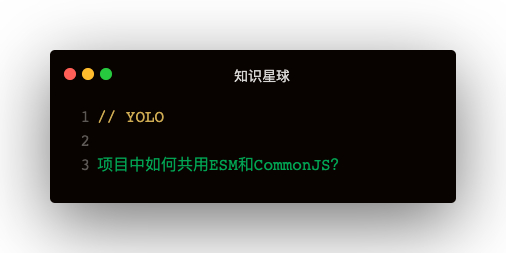

### 解答
#### node如何跑ESM模块的代码呢？
```
node --experimental-modules 1.mjs
```   
两个条件：
1. --experimental-modules
2. mjs后缀

#### 开源模块
##### module
package.json里面的module
```
{
  type: 'module',
  module: './1.js'
}

import { name1 } from 'test'
```   
设置了type: 'module'说明是ESM，没设置说明是CommonJS模块   

##### exports
**exports只有兼容ESM的Node才支持，版本13.2.0以上**   
```
"exports": {
  ".": {
    "require": "./main.cjs",
    "default": "./main.js"
  }
}
```