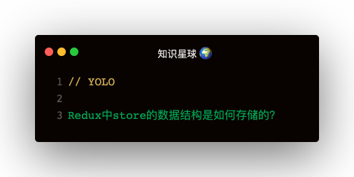

### 解答
- state是如何存储的？   
  - createStore函数内部有个currentState属性
  - 外部访问不到state，获取通过store.getState方法获取state，其实就是利用了必报
- state的数据结构是怎样的？
  - 初始值是preloadState，preloadState的结构即为state结构
- state如果改变？
  - 通过dispatch函数改变state，接收一个action: { type: 'add' }

### dispatch的原理
核心就是这一段：
```
currentState = currentReducer(currentState, action)
```   

通过currentReducer获取新的state