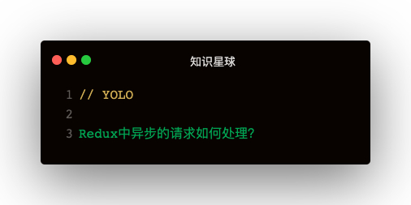

### 解答
#### redux-thunk
第一步：配置redux-thunk：
```
import { createStore, applyMiddleware, compose } from 'redux'
import thunk from 'redux-thunk'   
const enhancer = composeEnhancers(applymiddleware(thunk))
const store = createStore(reducer, enhancer)
```   
