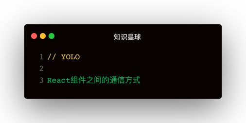

#### 解答
```
1. 父组件向自组件通信
  - 属性传递
2. 子组件向父组件通信
  - 属性方法传递
3. 跨组件通信
  - 属性传递，传递层级较深增加复杂度
  - 使用context
4. 没有嵌套关系的组件
  - 自定义事件通信（发布订阅）
  - redux等全局状态管理
  - 兄弟组件可以通信父组件通信
```   

#### 使用Context跨组件通信

```
const BatteryContext = createContext()
<BatteryContext.Consumer>
  {
    color => {}
  }
</BatteryContext.Consumer>

<BatteryContext.Provider value={color}>
  <Child></Child>
</BatteryContext.Provider>
```