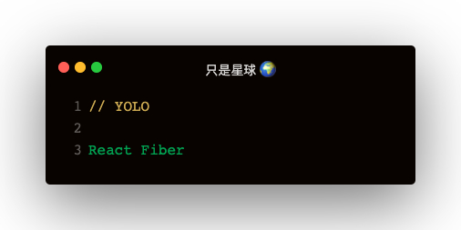

### Fiber出现的背景
- Stack reconciler的工作流程很像函数的调用过程。
  - 父组件里调用子组件，可以类比为函数的出递归
  - 对于特别庞大的vDOM树来说，reconciler过程会很长，超过16ms
  - reconciler期间，主线程是被js占用的，因为任何交互，布局，渲染都会停止，给用户卡了的感觉
- React在进行组件渲染时，从setState到渲染完成整个过程是同步的
  - 如果渲染的组件比较大，js执行会占据主线程事件比较长，导致react在动画，手势等应用中效果比较差

### Fiber实现原理
实现自己的组件调用栈，以链表的形式遍历组件树，可以灵活的暂停，继续和丢弃执行的任务。
Fiber其实是一种数据结构：   
```
const fiber = {
  stateNode,
  child,
  sibling,
  return,
}
```   
