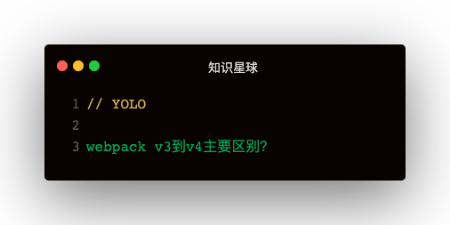

### 解答
1. 自动设置process.env.NODE_EVN：-mode development
2. UglifyJsPlugin。直接配置{ optimization: { minimize: true } }
3. CommonsChunkPlugin废弃，SplitChunksPlugin取而代之

#### splitChunks
- chunks：表示哪些代码需要优化
  - initial（初始块）
  - async（按需加载块）
  - all（全部）
- minSize：压缩前的最小模块大小，默认30KB
- minChunks：引用次数。默认为1
- maxAsyncRequests：按需加载时候最大的并行加载请求数，默认为5
- maxInitialRequests: 一个入口最大的并行请求数，默认为3
- name：拆分出来块的名字
- cacheGroups：缓存组
  - test：正则匹配哪些模块
  - priority：缓存组打包的先后优先级
  - reuseExstingChunk：当前代码块已有，就不再产生一个新的代码块

#### 使用splitChunks实现CommonsChunkPlugin的功能
只打包react：
```
optimization: {
  splitChunks: {
    chunks: 'all',
    cacheGroups: {
      vendors: {
        test: /react/,
        name: 'vendors'
      }
    }
  }
}
```   

打包vendor入口包括的依赖：
```
{
  entry: {
    vendor: ['react', 'react-dom'],
  }
  optimization: {
    splitChunks: {
      chunks: 'all',
      cacheGroups: {
        vendors: {
          name: 'vendors',
          chunk: 'initial'
        }
      }
    }
  }
}
```

#### splitChunks缺点
第一次打包vue，vuex，后面增加了lodash，浏览器中的vendor会失效