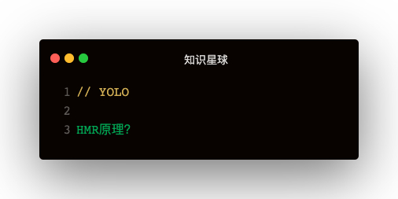

HMR的优势：   
live-server等工具检测代码变化刷新浏览器会丢失状态   
**webpack HMR不会刷新浏览器，而是运行时对模块进行热替换，保证了应用状态不会丢失**   

### 几个问题
1. webpack HMR阶段，在dist文件夹下面没有打包之后的文件，那么是如何启动的呢？
2. webpack-dev-server依赖于webpack-dev-middleware，webpack-dev-middleware在HMR中扮演什么角色？
3. 浏览器通过websocket跟webpack-dev-server通信，如何通信的？
4. 浏览器拿到最新的模块代码，如何将老模块替换成新模块，替换过程中如何处理模块之间的依赖关系？
5. 模块替换过程中，如果替换失败有什么回退机制吗？