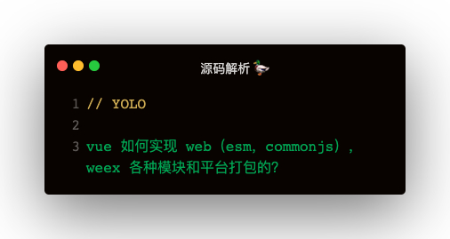

### rollup 基础
```
// 打包index.js
rollup index.js

// 输出文件
--file bundle.js

// 以何模块输出
--format iife/cjs/umd
```

#### rollup 配置文件
```
module.exports = {
    input: 'web/entry-runtime.js',
    external: ['vue', 'react'],
    output: {
        file: 'dist/vue.runtime.esm.js',
        format: 'es',
        banner: 'hello world!',
        name: 'Vue'
    }
}
```   

各模块何平台是如何打包的？
1. format：cjs，es，umd
2. input，output.file：各平台入口和输出文件都不一样

#### 命令行
1. -w：watch
2. -c：config文件
3. --environment： 配置环境变量   
    3.1 --environment TARGET:web-full-dev 🌰  process.env.TARGET === 'web-full-dev'