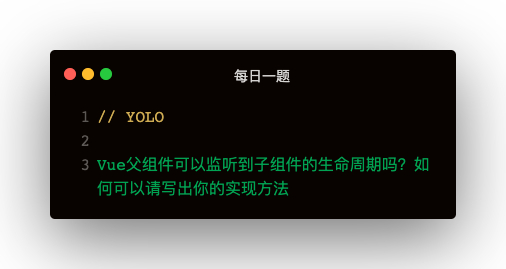

### 解法1: @hook
```
<Child @hook:mounted="childMounted" />
```
@hook:搭配任意钩子函数，会在子组件触发相应生命周期钩子函数时回调父组件这个函数   

### 解法2: $emit
这种方式比较蠢，而且是需要劳动力堆积的
```
<!-- Child.vue -->
mounted () {
  this.$emit('mounted')
}
<!-- Parent.vue -->
<Child @mounted="childMounted" />
```