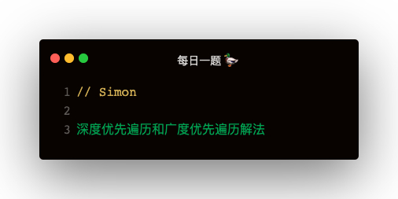

#### 从数据结构解
1. 深度优先遍历：【栈】     后进先出
2. 广度优先遍历：【队列】   先进先出   

#### DFS：depth first search
```
function dfs(node) {
    const stack = [node];
    while (stack.length) {
        const node = stack.pop();
        console.log(node.leaf);
        node.children.slice().reverse().forEach(child => {
            stack.push(child);
        })
    }
}
```

#### BFS：breadth first search
```
function bfs (node) {
    const queue = [node];
    while (queue.length) {
        const node = queue.shift();
        console.log(node.leaf);
        node.children.forEach(child => {
            queue.push(child);
        })
    }
}
```