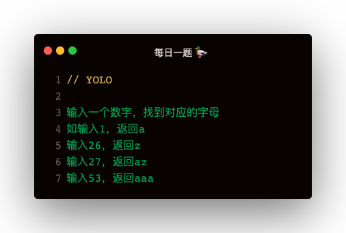

### 解答
```
function transfer (num) {
    const times = num / 26 | 0;
    const last = num % 26;
    let bit16Str = last > 0 ? `\\u00${last > 16 ? '7' : '6'}${(last % 16 || 16).toString(16)}` : '\\u007A';
    const lastStr = new Function(`return '${bit16Str}'`)();
    return ''.padStart(last ? times : times - 1, 'a') + lastStr;
}
```

#### 知识点
##### 进制转换
```
// 十进制转十六进制
(15).toString(16)
// 十六进制转十进制
Number('oxf')

// 十进制转二进制
(15).toString(2)
// 二进制转十进制
Number('0b1111')
```   

进制表示
```
二进制：0b
八进制：0o
十六进制：0x
```   

##### unicode 表示法
a-z: \u0061 - \u006f  \u0070 - \u007a

```
// unicode 转 string
方法一：eval(`'${str}'`)
方法二：new Function(`return '${str}'`)
方法三：unescape(str.replace(/\u/g, '%u'))


// string 转unicode
`\\u${str.charCodeAt(i).toString(16)}`
```

##### charCodeAt
返回 Unicode 码点，需转为16进制