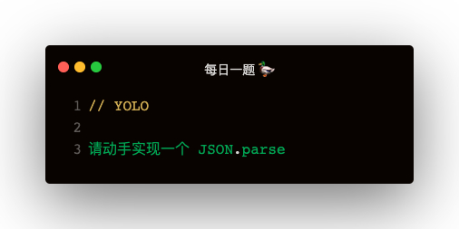

### 解答
总共两种方案：eval，Function

#### eval
```
function parse (jsonStr) {
    return eval(`(${jsonStr})`)
}
```

#### new Function
```
function parse (jsonStr) {
    return new Function(`return ${jsonStr}`)()
}
```