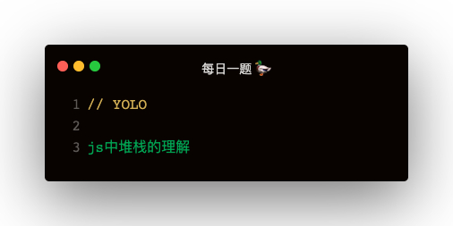

### 名词解释
ECStack：Execution Context Stack   
EC：Execution Stack   
VO：Variable Object   
AO：Activation Object   
Scope：作用域，函数声明时创建   
ScopeChain：作用域链   

### js 执行过程
解析 js 代码主要是以下步骤：
1. 创建一个 EC(G) 全局执行上下文
2. 创建一个 VO(G) 全局变量对象
3. 遇到变量声明，把它挂载到 VO(G) 上
4. 遇到函数声明，把它挂载到 VO(G) 上，并给函数赋予私有属性 [[Scopes]]
5. [[Scopes]] 是个数组，赋予值为上一层作用域的变量对象 VO(G)
6. 把 全局执行上下文 EC(G) 压入 执行环境栈 ECStack
7. 遇到函数 A 执行创建 EC(A)，并把 EC(A) 压入 ECStack
8. 函数 A 执行时会创建 AO(A)
9. AO 包含形参，实参 arguments，变量声明，函数声明

### 变量对象 和 活动对象 的关系
1. 活动对象属于变量对象
2. 变量对象理论上是，js引擎解析之后生成的挂载变量的对象
3. 当函数执行时，变量对象会被激活，变成活动对象
4. 变量对象只包含：变量声明 + 函数声明
5. 活动对象包含：形参 + 实参 arguments + 变量声明 + 函数声明

活动对象是函数执行时被创建的，通过 arguments 属性初始化，arguments 属性值是 Arguments 对象

### 作用域链
1. 在每个函数上有个私有属性 [[Scopes]]，包含了它的上层用户域的 AO
2. 一直循着 [[Scopes]] 查找，会找到全局 AO(G)
3. 这些 [[Scopes]] 就是链式结构，成为作用域链

### 闭包
函数嵌套的情况下，内部函数可以沿着私有属性 [[Scopes]] 使用外部作用域的变量，所以内部函数没有销毁的情况下，外部函数变量就需一直存在内存中，这种现象就称为闭包

### var let const
1. var 声明的变量会被定义在 VO(G) 即 window 上
2. let const 声明的对象不在 VO(G)上，会有一个新的 Scopes
3. function noop () { console.log(name) }; console.log(noop.prototype) 可以看到 noop 函数的 上层作用域

```
- prototype
    - consutructor
        - [[Scopes]]
            - 0: Script { name1: 'Alex', name2: 'Xiur' }
            - 1: Global { window }
```

### 上一道面试题
```
var a = {
    n: 1
};
var b = a;
a.x = a = {
    n: 2
};
console.log(a.x)
console.log(b)
```   

这道题的难点主要是 a.x = a = 的执行顺序，真实的顺序为：
```
a.x = {
    n: 2
}
a = {
    n: 2
}
```