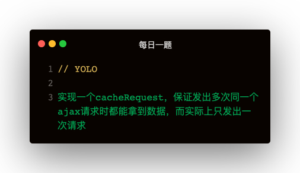

```
function cacheRequest (): (method: string, url: string, param: string | Document | Blob | ArrayBufferView | ArrayBuffer | FormData | URLSearchParams | ReadableStream<Uint8Array>) => Promise<{}> {
    const cache = {}
    return (method, url, param) => {
        const key = `${method}:${url}:${JSON.stringify(param)}`
        if (cache[key]) {
            return cache[key];
        }
        return (
            cache[key] = new Promise((resolve, reject) => {
                const xhr = new XMLHttpRequest();
                xhr.onreadystatechange = () => {
                    if (xhr.status === 200) {
                        const { response } = xhr
                        cache[url] = response
                        resolve(response)
                    }
                }
                xhr.open(method, url, true);
                xhr.setRequestHeader('Content-Type', 'applicetion/json');
                xhr.send(param);
            }).catch(e => {
                console.log('error:', e);
            })
        )
    }
}
```