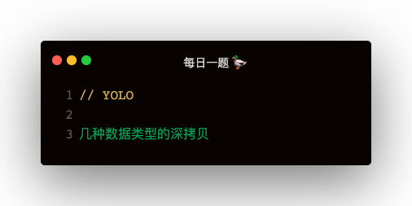

### 解答
#### RegExp 对象拷贝
```
const sourceReg = /abc/gi;

const copyReg = new RegExp(sourceReg.source, sourceReg.flags)
```

##### 从 url 中提取子域名
```
const url = 'http://xxx.domain.com';
/http:\/\/(\w+)\./.exec(url);
RegExp.$1
```    

#### function 函数拷贝
```
function aa (a, b) {
    console.log(a.toString(), a);
    console.log(b.toString(), b);
}

const funcStr = aa.toString();

const funcParaReg = /^function\s\w+\s{0,}\((.*)\)/;
const funcParaRet = funcStr.match(funcParaReg);
const funcPara = funcParaRet[1];

const funcBodyReg = /^function\s\w+\s{0,}\(.*\)\s{0,}{\n(.*)\n}$/s;
const funcBodyRet = funcStr.match(funcBodyReg);
const funcBody = funcBodyRet[1];

const params = []
funcPara && funcPara.split(',').forEach(param => params.push(param.trim()))
const b = new Function (...params, funcBody);
b(1111, 2222)
```

#### Map 对象拷贝
```
    const map = new Map();
    if (Object.prototype.toString.call(target) === '[object Map]') {
        for (let [key, value] of target.entries()) {
            map.set(key, value)
        }
    }
```   

#### Set 对象拷贝
```
    const set = new Set();
    if (Object.prototype.toString.call(target) === '[object Set]') {
        for (let item of target.values) {
            set.add(item)
        }
    }
```