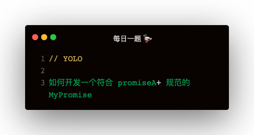

### 先开发 Promise 构造器函数
1. Promise 有三个状态：PENDING，FULFILLED，REJECTED
2. Promise 的状态一旦转变之后就会被冻结
3. 执行 executor 出错，会被 reject

```
const PENDING = 'PENDING';
const FULFILLED = 'FULFILLED';
const REJECTED = 'REJECTED';

class Promise {
    constructor (executor) {
        this.value = undefined;
        this.status = PENDING;
        this.onResolvedCallbacks = [];
        this.onRejectedCallbacks = [];

        const resolve = value => {
            if (this.status !== PENDING) return;
            this.value = value;
            this.status = FULFILLED;
            this.onResolvedCallbacks.forEach(f => f(value));
        }

        const reject = reason => {
            if (this.status !== PENDING) return;
            this.value = reason;
            this.status = REJECTED;
            this.onRejectedCallbacks.forEach(f => f(reason));
        }

        try {
            executor(resolve, reject)
        } catch (e) {
            reject(e);
        }
    }
}
```

### then 方法实现
1. 判断 onFulFilled，onRejected 是否合法，做兜底
2. 返回一个新 promise
3. 如果非 PENDING 状态，执行 onFulFilled 或 onRejected 得到返回值 x，执行 resolvePromise(promise2, x, resolve, reject)
3. 如果是 PENDING 状态，封装 onFulFilled 或 onRejected，把它们放入 onResolvedCallbacks 或 onRejectedCallbacks中

```
    then (onFulfilled, onRejected) {
        onFulfilled = typeof onFulfilled === 'function' ? onFulfilled : v => v;
        onRejected = typeof onRejected === 'function' ? onRejected : err => throw err;
        let promise2 = new Promise ((resolve, reject) => {
            let asyncResolve = this.macroTaskToResolve(promise2, resolve, reject);
            if (this.status === FULFILLED) {
                asyncResolve(onFulfilled);
            }
            if (this.status === REJECTED) {
                asyncResolve(onRejected);
            }
            if (this.status === PENDING) {
                this.onResolvedCallbacks.push(() => asyncResolve(onFulfilled));
                this.onRejectedCallbacks.push(() => asyncResolve(onRejected));
            }
        });
        return promise2;
    },
    macroTaskToResolve (promise2, resolve, reject) {
        return callback => {
            setTimeout(() => {
                try {
                    let x = callback(this.value);
                    resolvePromise(promise2, x, resolve, reject)
                } catch (e) {
                    reject(e);
                }
            });
        }
    }
```   

### resolvePromise 实现
1. 如果 promise2 和 x 一样，reject 循环引用错误
2. 如果 x 不是非 null 对象 或 函数，直接 resolve(x)
3. 如果 x.then 非函数，直接 resolve(x)
4. 如果 then 是函数，then.call(x)

```
function resolvePromise (promise2, x, resolve, reject) {
    if (promise2 === x) {
        return reject(new TypeError('循环引用'));
    }
    let called;
    if ((typeof x === 'object' && x !== null) || typeof x === 'function') {
        try {
            let then = x.then;
            if (typeof then === 'function') {
                then.call(
                    x,
                    y => {
                        if (called) return;
                        called = true;
                        resolvePromise(promise2, y, resolve, reject);
                    },
                    err => reject(err)
                )
            } else {
                if (called) return;
                called = true;
                resolve(x);
            }
        } catch (e) {
            if (called) return;
            called = true;
            reject(e);
        }
    } else {
        resolve(x);
    }
}
```

### 总结
写自定义 promise 主要是参考 promise A+ 规范，然后使用 promises-tests 单元测试来验证自定义 promise 是否符合规范

先来讲下 Promise 的构造函数：
1. Promise 有三种状态：PENDING，FULFILLED，REJECTED
2. 状态是不可逆的，一旦改变就会被冻结
3. Promise 接收一个回调函数，称为执行器
4. 执行器接收两个参数，resolve 方法和 reject 方法
5. 这两个方法做的事类似，把状态置为 FULFILLED，把值置为传入的值，遍历 onResolvedCallbacks 数组执行
6. 构造器中就会执行 executor，并加 try catch，报错会调用 reject

再讲 then：
1. then 接收两个参数：onFulfilled 和 onRejected 两个方法
2. 返回一个 promise2，所以直接再 new 一个 Promise 实例返回
3. 判断为 FULFILLED 状态，执行 onFulfilled 获得结果 x，执行 resolvePromise(promise2, x, resolve, reject)
4. 判断为 REJECTED 状态，执行 onRejected 获得结果 x，执行 resolvePromise(promise2, x, resolve, reject)
5. 判断为 PENDING 状态，放入 onResolvedCallbacks 数组
6. onFulFilled 和 resolvePromise 是异步操作，所以 setTimeout 包起来

最后是 resolvePromise：
1. 首先判断 promise2 === x，等于的话表示循环引用，reject(new TypeError('循环引用'))
2. 如果 x 为 null，并且非函数，直接 resolve(x)
3. 否则，如果 x.then 为非函数，直接 resolve(x)
4. x.then 为函数，x.then.call(x, y => resolvePromise(promise2, y, resolve, reject), err => reject(err))