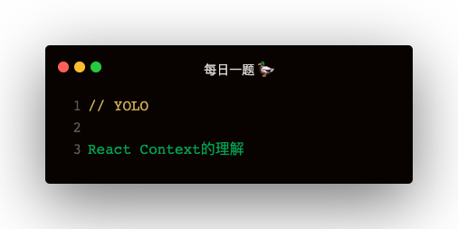

### 解答
React Context 主要是解决跨层级组件数据传递，可以当作是特定一个组件树内共享的store

#### 过时的Context
```
class Parent extends PureComponent {
    getChildContext () {
        return { color: 'red' }
    }
}

Parent.childContextTupes = {
    color: PropTypes.string
}

Child.contextTypes = {
    color: PropTypes.string
}
```

#### 新Context
```
const ThemeContext = React.createContext('light');

// Parent
<ThemeContext.Provider value="dark">
    <ThemedButton />
</ThemeContext.Provider>

class ThemedButton extends PureComponent {
    static contextType = ThemeContext;
    render () {
        this.context
    }
}
```

#### 优缺点
优点：不同层级的组件需要访问同样一些数据   

缺点：组件的复用性变差   

组件复用是一种更好的方式