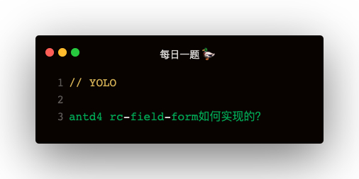

### 学习 rc-field-form 的几个知识点
1. 实现Form组件的数据上下文高阶组件
2. 实现Form组件中的数据托管
3. 实现Form组件中的双向数据绑定
4. 实现Form组件中的强制更新
5. 实现Form组件中的异步表单校验

### rc-field-form 的使用
```
import Form, { Field } from 'rc-field-form'

const validateUniqueName = (name, value) => {
    return new Promise(resolve => {
        setTimeout(() => {
            resolve(value === 'xiur' ? `${name} is not unique` : '')
        }, 3000)
    })
}

<Form
    initialValues={{ username: 'xiur', password: '1234' }}
    onFinish={(values) => {
        console.log('成功：', values)
    }}
    onFinishFailed={(error) => {
        console.log('失败：', error)
    }}
>
    <Form name='username' rules={[{ required: true }, { min: 3 }, { max: 6 }, { validate: validateUniqueName }]}>
        <input placeholder='请输入用户名' />
    </Form>
    <Form name='password' rules=[{ required: true }]>
        <input placeholder='请输入密码' />
    </Form>
</Form>
```   

### 实现逻辑
#### Form 组件
1. 实例化 formInstance
2. 初始化 store
3. 设置 callbacks
4. 使用 context   

#### Field 组件
1. 获取 context
2. 克隆 children 重写 props
3. 注册 Field
4. 声明 onStateChange，store 改变 forceUpdate   

#### useForm
1. useForm 返回 formInstance
2. FormStore 数据托管   

#### async-validate
1. 数据校验

### Form 实现
**如何实现初始值只设置一次？**   
场景：比如外部的父组件更新，会造成 Form 组件的更新，此时会重新设置 initialValue，可是此时已经不是初始化了    
**使用 React.useRef 单例解决这个问题**

```
const FieldContext = React.createContext()
const Form = ({ initialValues, onFinish, onFinishFailed, children }) => {
    const [ formInstance ] = useForm()
    const mountRef = React.useRef(null)
    if(!mountRef.current) {
        formInstance.setInitialValues(initialValues)
        formInstance.setCallbacks({ onFinish, onFinishFailed })
        mountRef.current = true
    }
    return <form>
        <FieldContext.Provider value={formInstance}>
            {children}
        </FieldContext.Provider>
    </form>
}
```   

### useForm 实现
```
class FormStore {
    constructor (forceRootUpdate) {
        this.forceRootUpdate = forceRootUpdate
        this.store = {}
        this.callbacks = {}
        this.fieldEntities = []
    }
    setCallbacks = callbacks => {
        this.callbacks = {...callbacks}
    }
    setInitialValues = store => {
        this.store = {...store}
    }
    setFieldValue = (name, value) => {
        this.store[name] = value
        this.notify()
    }
    getFieldValue = name => {
        return this.store[name]
    }
    registerField = (fieldEntity) => {
        this.fieldEntities.push(fieldEntity)
    }
    notify = () => {
        for (let fieldEntity of this.fieldEntities) {
            fieldEntity.onStateChange()
        }
    }
    submit = () => {
        const descriptor = {}
        this.fieldEntities.forEach(fieldEntity => {
            const { name, rules } = fieldEntity.props
            if (rules) {
                const ruleInfo = {}
                rules.forEach(rule => {
                    const ruleKeys = Object.keys(rule)
                    ruleKeys.forEach(ruleKey => {
                        ruleInfo[ruleKey] = rule[ruleKey]
                    })
                })
                descriptor[name] = ruleInfo
            }
        })

        new Schema(descriptor).validate(this.store)
        .then(values => {
            this.callbacks.onFinish(values)
        })
        .catch(error => {
            this.callbacks.onFinishFailed(error)
        })
    }
    getForm = () => {
        return {
            setInitialValues: this.setInitialValues,
            setCallbacks: this.setCallbacks,
            setFieldValue: this.setFieldValue,
            getFieldValue: this.getFieldValue,
            registerField: this.registerField,
            submit: this.submit,
        }
    }
}

function useForm () {
    const formRef = React.useRef(null)
    const [, forceUpdate] = React.useState()
    if (!formRef.current) {
        const formStore = new FormStore(forceUpdate)
        const formInstance = formStore.getForm()
        formRef.current = formInstance
    }
    return [formRef.current]
}
```   

#### async-validate 实现
```
class Schema {
    constructor (descriptor) {
        this.descriptor = descriptor
    }
    validate () {
        return new Promise(async (resolve, reject) => {
            let errorInfo = []
            const fieldNames = Object.keys(this.descriptor)
            for (let i = 0; i < fieldNames.length; i++) {
                const fieldName = fieldNames[i]
                let errors = []
                const filedRules = this.descriptor[fieldName]
                const fieldRuleNames = Object.keys(filedRules)
                for (let i = 0; i < fieldRuleNames.length; i++){
                    const fieldRuleName = fieldRuleNames[i]
                    switch (fieldRuleName) {
                        case 'required':
                            if (!values[fieldName]) {
                                errors.push(`${fieldName} is required`)
                            }
                            break
                        case 'min':
                            if (values[fieldName].length < filedRules[fieldRuleName]) {
                                errors.push(`${fieldName} 最小为${filedRules[fieldRuleName]}位字符`)
                            }
                            break
                        case 'max':
                            if (values[fieldName].length > filedRules[fieldRuleName]) {
                                errors.push(`${fieldName} 最大为${filedRules[fieldRuleName]}位字符`)
                            }
                            break
                        case 'validate':
                            const validateFn = filedRules[fieldRuleName]
                            const result = await validateFn(fieldName, values[fieldName])
                            if (result.length > 0) {
                                errors.push(result)
                            }
                    }
                }
                errors.length > 0 ? errorInfo.push({ name: fieldName, errors }) : void(0)
            }
            errorInfo.length > 0 ? reject({ errorInfo, values }) : resolve(values)
        })
    }
}
```

### Field 实现
这里主要实现 双向数据绑定 和 强制刷新
1. input 的 value 的获取 从 this.context 通过 getFiledValue 获取
2. 当 onChange 触发通过 setFieldValue 改变 store 时，需要更新UI，就通过 store 的 notify 调用各个 Field 的 onStateChange 实现

```
class Field extends React.Component {
    static contextType = FieldContext
    componentDidMount () {
        const formInstance = this.context
        formInstance.registerField(this)
    }
    onStateChange = () => {
        this.forceUpdate
    }
    getControlled = () => {
        const formInstance = this.context
        const { name, children } = this.props
        return React.cloneElement(children, {
            ...children.props,
            value: formInstance.getFieldValue(name),
            onChange: (e) => {
                formInstance.setFieldValue(name, e.target.value)
            }
        })
    }
    render () {
        return this.getControlled()
    }
}
```   