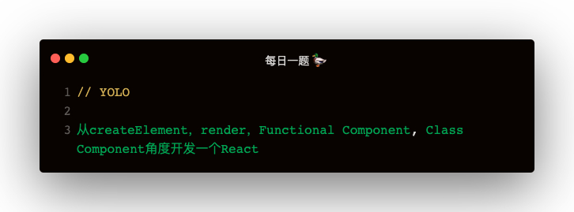

### 解答
#### jsx是什么？
javascript + xml，用来描述页面上元素和结构，那么 jsx 会被转换成什么？
> babel ast 编译：https://babeljs.io/repl

#### 普通元素的编译
```
<div>
    <span>时钟：</span>
    <span>{new Date().toLocalString()}</span>
</div>

React.createElement(
    "div",
    null,
    React.createElement("span", null, "\u65F6\u949F\uFF1A"),
    React.createElement("span", null, new Date().toLocalString())
)
```

#### 组件的编译
```
<Clock name={'时钟'}/>

React.createElement(Clock, {
  name: '时钟'
})
```

#### 总结
可以看到 jsx 会被编译为 React.createElement，这也是为什么用到 jsx 的文件都要手动 import react   

1. jsx 是 javascript + xml 用来描述页面结构的一种语法
2. jsx 会被 babel-loader 编译成 React.createElement 方法执行生成 virtual dom

### 简单实现一个react，满足创建虚拟 dom 和渲染的目标
jsx 文件编译之后如下：
```
const ClockJsx = React.createElement('div', { className: 'jsx' }, '时钟1：', new Date().toLocalString());
const Clock1 = ({ name }) => return React.createElement('div', { className: 'functional' }, name, new Date().toLocalString());
class Clock2 extends React.Component {
    render () {
        return React.createElement('div', { className: 'class' }, name, new Date().toLocalString());
    }
}

ReactDOM.render(React.createElement(
    'div',
    null,
    ClockJsx,
    Clock1,
    Clock2,
), document.getElementById('root'))
```

#### createElement
接收三个参数：
1. type: string
2. props: object | null
3. children ?: string | Array

作用：构建 virtual dom
```
// react.js
function createElement (type, props, ...children) {
    const childrenLength = children.length;
    if (childrenLength === 1) {
        props.children = children[0];
    } else if (childrenLength > 1) {
        props.children = children
    }
    return ReactElement(type, props);
}

function ReactElement (type, props) {
    return { type, props }
}

export default {
    createElement,
}
```

#### render
render 会把 createElement 的结果渲染到页面，拿 class 组件举例 createElement 的结果如下
```
{
    type: 'div',
    props: {
        className: 'class',
        children: [
            name,
            new Date().toLocalString()
        ]
    }
}
```

第一版 render 实现：
```
function render (VNode, parentNode) {
    if (typeof VNode === 'string') {
        return parentNode.appendChild(document.createTextNode(VNode));
    }
    let { type, props } = VNode;
    const currentEl = document.createElement(type);
    for (let prop in props) {
        switch (prop) {
            case 'className':
                currentEl.className = props.className;
                break;
            case 'style':
                Object.keys(props.style).forEach(styleName => {
                    currentEl.style[styleName] = props.style[styleName]
                });
                break;
            case 'value':
                if (['input', 'textarea'].includes(type)) {
                    currentEl.value = value;
                } else {
                    currentEl.setAttribute('value', props.value);
                }
                break;
            case 'children':
                if (Array.isArray(props.children)) {
                    props.children.forEach(child => render(child, currentEl));
                } else {
                    render(prosp.children, currentEl);
                }
                break;
            default:
                currentEl.setAttribute(prop, props.prop);
                break;
        }
    }
    parentNode.appendChild(currentEl);
}
```

#### 函数组件和类组件的 render 支持
函数组件和类组件与普通 JSX 的区别在于 type，type 一般为节点名称，可是函数组件 type 为函数名，类组件 type 为类名   
```
在获取 type 之后，判断是函数组件 或 类组件，分别获取其JSX，然后走普通JSX的逻辑
let { type, props } = VNode;
if (typeof type === 'function') {
    const functionalJsx = type(props);
    type = functionalJsx.type;
    props = functionalJsx.props;
}
if (type.isReactComponent) {
    const classJsx = new type(props).render();
    type = classJsx.type;
    props = classJsx.props;
}
```    

类组件还需要实现一个基类 React.Component

#### React.Component
```
class Component {
    static isReactComponent = true;
    constructor (props) {
        this.props = props;
    }
}

export default {
    createElement,
    Component,
}
```